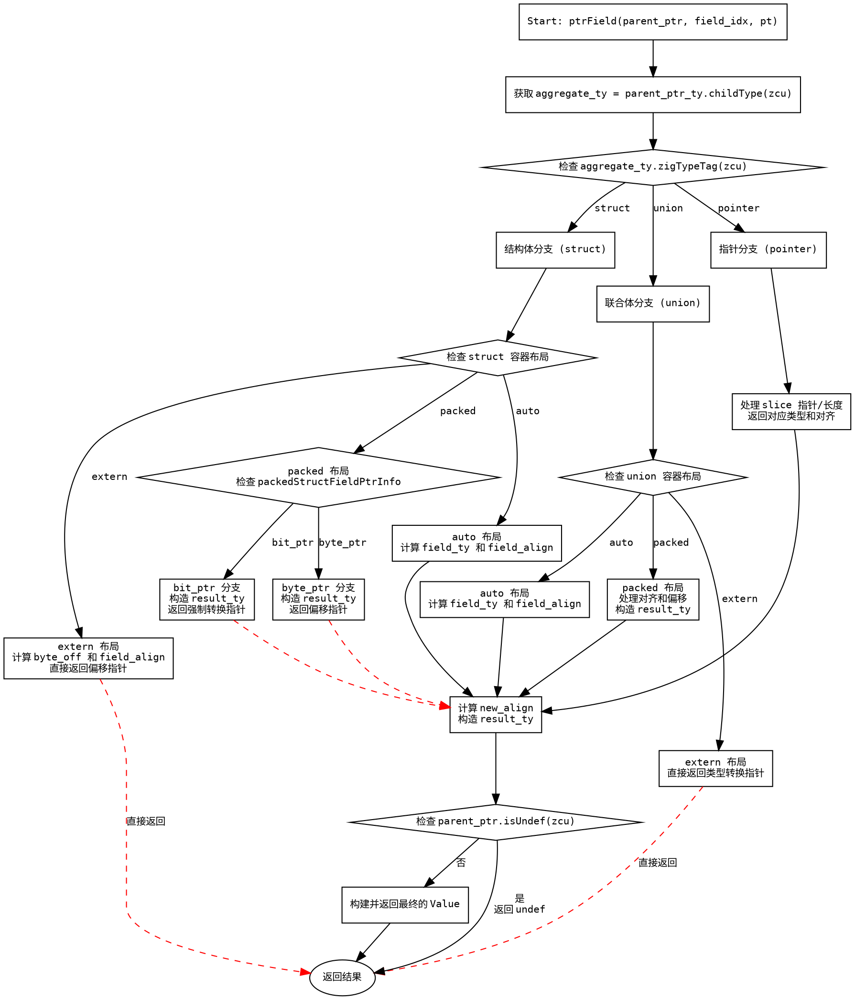

好的，我需要为提供的 Zig 函数 `ptrField` 绘制一个流程图。首先，我需要理解这个函数的结构和逻辑流程，然后将其转换为 Graphviz 的 DOT 语言格式。

首先，函数 `ptrField` 接受三个参数：`parent_ptr`、`field_idx` 和 `pt`。它的主要作用是根据父指针和字段索引，生成指向该字段的指针。函数内部包含多个条件分支，特别是针对不同类型的聚合类型（struct、union、pointer）的处理。

接下来，我需要将函数的控制流分解成不同的节点和边。主要的分支点包括：

1. 检查 `aggregate_ty` 的类型标签（ZigTypeTag），分为 struct、union、pointer 三种情况。
2. 对于 struct 类型，进一步根据容器布局（auto、extern、packed）处理。
3. 对于 union 类型，同样处理不同的容器布局。
4. 对于 pointer 类型，处理 slice 的 ptr 和 len 字段。
5. 后续处理新的对齐方式和构建结果类型 `result_ty`。
6. 处理 `parent_ptr` 是否为未定义（undef）的情况。
7. 最终返回构建的 Value。

每个分支内部可能还有子分支，例如在 struct 的 packed 布局中处理 bit_ptr 和 byte_ptr 的情况，或者在 union 的 packed 布局中处理不同条件。

需要注意各个条件之间的跳转关系，例如在 struct 的 extern 布局中直接返回结果，而不会进入后续的通用处理流程。而其他情况可能需要继续执行后续的代码。

接下来，我需要将这些逻辑步骤转化为流程图节点，并用箭头表示执行顺序和条件分支。例如：

- 开始节点：函数入口。
- 获取 `aggregate_ty` 的类型标签。
- 根据类型标签进入不同的分支。
- 每个分支内部处理完毕后，可能直接返回或继续后续步骤。
- 处理对齐方式和构建 `result_ty`。
- 检查 `parent_ptr` 是否为 undef。
- 构建并返回最终的 Value。

需要确保所有可能的执行路径都被覆盖，包括错误处理和断言。同时，注意循环和递归调用是否存在（当前函数似乎没有循环，主要是条件分支）。

最后，将这些节点和边用 Graphviz 的 DOT 语法表示出来，使用正确的形状（如菱形表示条件判断，矩形表示处理步骤，椭圆形表示开始和结束），并标注条件分支的标签（如 "struct", "extern" 等）。

可能会遇到的挑战是处理复杂的嵌套条件，尤其是 struct 和 union 内部的多个子情况，需要正确连接各个节点，避免遗漏分支。此外，确保返回语句的路径正确终止流程，不进入后续步骤。

现在，将这些分析转化为具体的 Graphviz 流程图。
================================================
