好的，我需要为给定的Zig函数`readFromMemory`绘制一个流程图。首先，我需要仔细阅读并理解这个函数的逻辑结构。函数主要处理不同类型的数据，根据不同的类型执行不同的操作。

首先，函数开始时会检查类型`ty`的`zigTypeTag`，然后根据不同的类型标签进入不同的分支。例如，如果是`void`类型，直接返回`Value.void`；如果是`bool`类型，根据缓冲区第一个字节的值返回`true`或`false`。接下来是处理整数和枚举类型，这里分为快速路径（小于等于64位）和慢速路径（大整数）。然后是浮点数、数组、向量、结构体、错误集合、联合体、指针、可选类型等。

我需要为每个类型分支创建一个流程节点，并按照代码的执行顺序连接它们。需要注意的是，某些分支内部还有子分支，比如结构体的不同布局（`extern`和`packed`），联合体的不同容器布局等。此外，错误处理部分也需要在流程图中体现，例如返回错误`error.IllDefinedMemoryLayout`或`error.Unimplemented`的情况。

需要注意的细节包括：

1. 各分支的条件判断，如`switch (ty.zigTypeTag(zcu))`后的各个case。
2. 函数内部的递归调用，例如处理数组类型时会递归调用`readFromMemory`。
3. 错误处理路径，例如`return error.Unimplemented`。
4. 不同路径的返回值和错误返回。

在绘制流程图时，应使用Graphviz的DOT语言，正确表示各个判断节点、处理步骤和流向。每个主要类型分支应作为一个菱形判断节点，后续处理步骤作为矩形处理节点，错误路径和返回路径作为箭头标注。

需要确保所有可能的执行路径都被覆盖，包括正常返回和错误返回。同时，注意代码中的断言和未实现的情况，如`else => unreachable`或`else => return error.Unimplemented`。

最后，生成的流程图应清晰展示函数的逻辑结构，便于理解各个类型处理的流程和相互关系。
================================================

```dot
digraph readFromMemory_flowchart {
    graph [rankdir=TB];
    node [shape=rectangle, style=rounded];

    start [label="开始: readFromMemory(ty, pt, buffer, arena)"];
    check_ty [label="检查 ty.zigTypeTag(zcu)", shape=diamond];
    
    // 基本类型分支
    void_case [label="返回 Value.void"];
    bool_case [label="检查 buffer[0]\n0 → Value.false\n非0 → Value.true"];
    int_enum_case [label="处理 int/enum:\n判断 bits ≤64?\n快速路径/大整数路径"];
    float_case [label="读取浮点数并构造 Value"];
    array_case [label="递归处理数组元素"];
    vector_case [label="调用 readFromPackedMemory"];
    struct_case [label="处理结构体:\n判断 layout (extern/packed)"];
    error_set_case [label="读取错误码并构造 error Value"];
    union_case [label="处理联合体:\n判断容器布局"];
    pointer_case [label="读取 usize 构造指针 Value"];
    optional_case [label="递归处理可选子类型"];
    unimplemented [label="返回 error.Unimplemented", color=red];
    ill_defined [label="返回 error.IllDefinedMemoryLayout", color=red];
    
    // 连接节点
    start -> check_ty;
    
    check_ty -> void_case [label=".void"];
    check_ty -> bool_case [label=".bool"];
    check_ty -> int_enum_case [label=".int / .enum"];
    check_ty -> float_case [label=".float"];
    check_ty -> array_case [label=".array"];
    check_ty -> vector_case [label=".vector"];
    check_ty -> struct_case [label=".struct"];
    check_ty -> error_set_case [label=".error_set"];
    check_ty -> union_case [label=".union"];
    check_ty -> pointer_case [label=".pointer"];
    check_ty -> optional_case [label=".optional"];
    check_ty -> unimplemented [label="其他类型"];
    
    // 结构体分支
    struct_case -> struct_case_extern [label=".extern"];
    struct_case -> struct_case_packed [label=".packed"];
    struct_case_extern [label="递归处理每个字段"];
    struct_case_packed [label="调用 readFromPackedMemory"];
    
    // 联合体分支
    union_case -> ill_defined [label=".auto"];
    union_case -> union_extern [label=".extern"];
    union_case -> union_packed [label=".packed"];
    union_extern [label="构造字节数组 Value"];
    union_packed [label="调用 readFromPackedMemory"];
    
    // 通用返回路径
    void_case -> end;
    bool_case -> end;
    int_enum_case -> end;
    float_case -> end;
    array_case -> end;
    vector_case -> end;
    struct_case_extern -> end;
    struct_case_packed -> end;
    error_set_case -> end;
    union_extern -> end;
    union_packed -> end;
    pointer_case -> end;
    optional_case -> end;
    
    end [label="返回构造的 Value"];
    error_path [shape=oval, label="错误路径", color=red];
    ill_defined -> error_path;
    unimplemented -> error_path;
}
``` 

该流程图使用 Graphviz DOT 语言描述，展现了以下核心逻辑：

1. 函数从类型检查开始，根据不同的类型标签进入分支
2. 每个类型分支包含具体的处理逻辑（如快速整数路径、递归处理数组等）
3. 结构体和联合体类型包含嵌套布局判断
4. 错误路径用红色标注（如未实现类型、非法内存布局）
5. 所有正常路径最终汇聚到统一的返回节点
6. 特殊操作如 readFromPackedMemory 调用被显式标注

可以通过 Graphviz 工具生成可视化流程图，命令示例：  
`dot -Tpng flowchart.dot -o flowchart.png`