嗯，我现在需要帮用户用Graphviz画出一个Zig函数的流程图。这个函数是readFromPackedMemory，看起来有点复杂。首先，我得理解这个函数的结构，然后根据不同的类型分支来绘制流程图。

首先，函数开始的时候，会处理不同的类型标签，比如void、bool、int等等。每个case里面有不同的处理逻辑。比如bool类型会读取buffer中的某个bit，判断是0还是1，然后返回true或false。int类型则有快速路径和慢速路径，取决于bits的大小是否超过64位。还有float、vector、struct等其他类型的处理。

接下来，我需要确定每个分支的结构，以及它们之间的流程关系。可能每个switch case都是一个独立的流程分支，然后每个分支内部可能会有一些操作，比如分配内存、读取数据、处理大整数等。例如，int类型的分支中有条件判断bits是否<=64，分为unsigned和signed两种情况，如果超过64位则进入大整数处理流程。

然后，对于struct类型，可能需要遍历所有字段，递归调用readFromPackedMemory来处理每个字段的值。同样，vector类型也需要处理每个元素，根据endian确定顺序。union类型也有不同的布局处理。

需要注意的是，函数中有递归调用的情况，比如处理struct的字段时，会再次调用readFromPackedMemory。这在流程图中可能需要表示为子流程或者循环结构。

此外，错误处理部分，比如返回的错误类型IllDefinedMemoryLayout和OutOfMemory，以及可能的panic，也需要在流程图中体现出来，比如使用菱形判断节点来表示错误条件。

可能的结构是，整个函数从开始节点进入，然后根据类型标签分支出不同的处理流程。每个分支内部根据具体情况处理，可能会有条件判断、循环、函数调用等步骤。最后，每个分支结束后返回相应的Value。

需要注意的是，Graphviz使用的是DOT语言，所以需要正确使用节点和边的定义，合理排列结构，避免交叉过多。可能需要使用子图来分组不同的处理分支，或者使用记录节点来表示多个步骤。

比如，主流程开始，进入switch节点，然后每个case对应一个处理分支。每个分支内部的结构需要细化，比如bool分支中的读取字节、位移操作、判断位值等步骤。int分支中的条件判断bits大小，然后不同的处理路径。结构体和向量可能需要循环处理每个元素或字段。

同时，函数中有递归调用，比如处理struct字段时调用自身，这在流程图中可能需要表示为指向自身函数的节点，或者用子流程表示。

另外，错误返回节点需要连接到相应的错误处理路径，比如分配内存失败时的OutOfMemory错误，或者结构体布局问题导致的IllDefinedMemoryLayout错误。

最后，确保所有可能的路径都被覆盖，包括正常返回和错误返回。可能需要使用不同的颜色或形状来区分不同类型的节点，比如处理步骤用矩形，判断用菱形，错误节点用红色等。

总结一下，我需要将函数分解为各个类型处理的分支，每个分支内的逻辑步骤和条件判断，递归调用的情况，以及错误处理路径，然后用Graphviz的DOT语法将这些元素连接起来，形成一个清晰的流程图。
================================================

```dot
digraph readFromPackedMemory {
    graph [fontname="Arial", rankdir=TB];
    node [fontname="Arial", shape=rectangle];
    edge [fontname="Arial"];

    start [label="Start readFromPackedMemory", shape=ellipse];
    end [label="Return Value", shape=ellipse];
    error [label="Error Handling:\nIllDefinedMemoryLayout\nOutOfMemory", shape=hexagon];

    start -> switch_ty_tag;

    subgraph cluster_switch {
        label="Switch on ty.zigTypeTag(zcu)";
        switch_ty_tag [label="Type Tag Switch", shape=diamond];
        
        switch_ty_tag -> void [label="void"];
        switch_ty_tag -> bool [label="bool"];
        switch_ty_tag -> int [label="int"];
        switch_ty_tag -> enum [label="enum"];
        switch_ty_tag -> float [label="float"];
        switch_ty_tag -> vector [label="vector"];
        switch_ty_tag -> struct [label="struct"];
        switch_ty_tag -> union [label="union"];
        switch_ty_tag -> pointer [label="pointer"];
        switch_ty_tag -> optional [label="optional"];
        switch_ty_tag -> todo [label="else"];
    }

    // Void case
    void [label="Return Value.void"];
    void -> end;

    // Bool case
    bool [label="Get byte from buffer\nbased on endianness"];
    bool -> check_bit;
    check_bit [label="Check bit (bit_offset % 8)", shape=diamond];
    check_bit -> return_false [label="0"];
    check_bit -> return_true [label="1"];
    return_false [label="Return Value.false"];
    return_true [label="Return Value.true"];
    return_false -> end;
    return_true -> end;

    // Int case
    int [label="Check bits <= 64", shape=diamond];
    int -> fast_path [label="Yes"];
    int -> slow_path [label="No"];
    fast_path [label="Read u64/i64\nvia readVarPackedInt"];
    fast_path -> pt_int_value;
    pt_int_value [label="pt.intValue(ty, ...)"];
    pt_int_value -> end;
    slow_path [label="Alloc limbs_buffer\nConstruct BigInt"];
    slow_path -> bigint_init;
    bigint_init [label="bigint.readPackedTwosComplement(...)"];
    bigint_init -> pt_int_value_big;
    pt_int_value_big [label="pt.intValue_big(...)"];
    pt_int_value_big -> end;

    // Enum case
    enum [label="Read underlying int\nvia recursive call"];
    enum -> get_coerced;
    get_coerced [label="pt.getCoerced(...)"];
    get_coerced -> end;

    // Float case
    float [label="Read packed float\nbased on bit-width"];
    float -> intern_float;
    intern_float [label="pt.intern(...)"];
    intern_float -> end;

    // Vector case
    vector [label="Iterate elements\nreverse order if big-endian"];
    vector -> recursive_vector_elements;
    recursive_vector_elements [label="Recursive readFromPackedMemory\nfor each element"];
    recursive_vector_elements -> intern_aggregate;
    intern_aggregate [label="pt.intern(.aggregate)"];
    intern_aggregate -> end;

    // Struct case
    struct [label="Iterate struct fields"];
    struct -> recursive_struct_fields;
    recursive_struct_fields [label="Recursive readFromPackedMemory\nfor each field"];
    recursive_struct_fields -> intern_aggregate;

    // Union case
    union [label="Read backing type\nvia recursive call"];
    union -> intern_union;
    intern_union [label="pt.internUnion(...)"];
    intern_union -> end;

    // Pointer case
    pointer [label="Read usize\nvia recursive call"];
    pointer -> intern_ptr;
    intern_ptr [label="pt.intern(.ptr)"];
    intern_ptr -> end;

    // Optional case
    optional [label="Read child type\nvia recursive call"];
    optional -> check_zero;
    check_zero [label="Check child_val == 0", shape=diamond];
    check_zero -> return_none [label="EQ"];
    check_zero -> return_child [label="GT"];
    return_none [label="Return .none"];
    return_child [label="Return child_val"];
    return_none -> intern_opt;
    return_child -> intern_opt;
    intern_opt [label="pt.intern(.opt)"];
    intern_opt -> end;

    // Error handling
    slow_path -> error [label="Alloc failure"];
    recursive_vector_elements -> error [label="Possible errors"];
    recursive_struct_fields -> error;
    enum -> error [label="Possible errors"];
    // ...其他可能出错的路径连接到error节点

    todo [label="@panic(\"TODO...\")", shape=octagon];
    todo -> end;

    error -> end [style=dashed];
}
```
