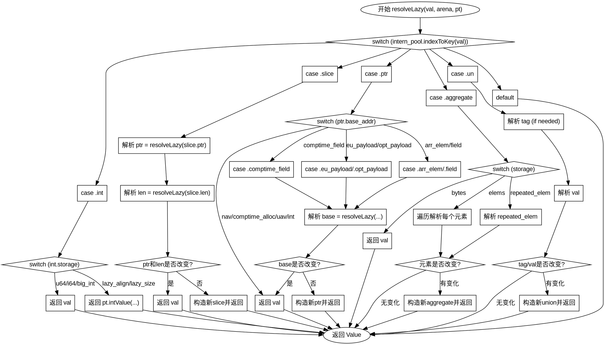

好的，我需要为给定的Zig函数绘制流程图。首先，我要仔细阅读代码，理解它的结构和逻辑流程。这个函数叫做resolveLazy，主要处理不同类型的Value，递归地解析它们。

首先，函数开始于一个switch语句，根据val的类型进入不同的处理分支。每个分支对应不同的数据结构，比如int、slice、ptr、aggregate、un等。我需要为每个分支绘制相应的流程。

对于int类型，处理比较简单，直接返回val或者调用pt.intValue。slice类型需要递归解析ptr和len，如果它们没有变化则返回原值，否则构造新的slice。ptr类型有多个子情况，比如base_addr的不同类型（nav、comptime_alloc等），每个子情况可能需要递归解析base，然后根据是否变化决定返回原值还是新构造的ptr。

aggregate类型分为bytes、elems和repeated_elem。elems需要遍历每个元素递归解析，如果有变化则复制到新数组。repeated_elem只需解析一次，如果变化则替换。un类型需要解析tag和val，如果有变化则构造新的union。

需要注意的是递归调用resolveLazy的地方，比如在处理slice的ptr和len时，以及在处理ptr的各个子情况时。这些递归调用需要在流程图中体现出来，可能需要用子流程或者循环结构。

另外，错误处理部分（try语句）也需要在流程图中表示，比如可能的错误路径。不过函数返回的是Zcu.SemaError!Value，所以每个try都可能跳转到错误处理，但流程图可能更关注正常流程。

最后，确保所有分支都有对应的处理，并且没有遗漏。每个case结束后的返回路径要正确连接。可能需要使用菱形判断框来表示条件判断，比如判断解析后的值是否与原值相同，从而决定是否返回原值或新值。

总结步骤：
1. 确定函数入口和各主要分支。
2. 为每个分支绘制处理流程，包括递归调用。
3. 处理条件判断，如是否值有变化。
4. 连接所有返回路径，确保流程正确。
5. 使用graphviz语法构建流程图，注意节点和边的正确连接。
================================================
