嗯，用户让我用Graphviz来画这个Zig函数的流程图。首先，我需要仔细阅读代码，理解它的结构和各个分支。这个函数叫做writeToMemory，看起来是处理不同类型的数据，并将它们写入内存缓冲区。

首先，函数开始会检查val是否是未定义的（isUndef），如果是，就用0xaa填充缓冲区。然后根据类型标签（zigTypeTag）进行不同的处理，比如bool、int、float、数组、结构体等等。每个case有不同的处理逻辑，比如对于整数类型，会处理大端或小端编码，数组类型会递归处理每个元素，结构体需要考虑布局（auto、extern、packed）等。

接下来，我需要确定如何将这些逻辑转化为流程图。流程图通常包括开始、结束、判断节点、处理步骤等。每个switch case应该作为一个分支，特别是那些可能返回错误或继续处理的地方。

需要注意的是，有些处理会递归调用writeToMemory，比如数组和结构体的处理，这时候在流程图中可能需要表示递归的节点。此外，错误处理也是一个重要部分，每个可能返回错误的地方都需要有相应的节点。

还有，用户特别指出不要用Mermaid，而是用Graphviz，所以我需要确保生成的代码是Graphviz的DOT语言。要正确使用节点和边，合理分组，使得流程图清晰易读。

在画图过程中，可能会遇到复杂的结构，比如结构体的extern布局需要循环处理每个字段，这时候可能需要一个循环节点。同样，联合体（union）有不同的容器布局，也需要不同的处理分支。

最后，要检查是否有遗漏的分支或错误处理，确保流程图覆盖所有可能的执行路径，包括各种错误返回和正常结束的情况。
================================================

```dot
digraph writeToMemory {
    graph [fontname="Arial", nodesep=0.5, ranksep=1];
    node [shape=rectangle, fontname="Arial", style=filled, fillcolor="#f0f0f0"];
    edge [fontname="Arial"];

    start [label="Start writeToMemory", shape=ellipse, fillcolor="#c0ffc0"];
    end [label="Return", shape=ellipse, fillcolor="#ffc0c0"];
    error [label="Error Return", shape=ellipse, fillcolor="#ffc0c0"];

    subgraph cluster_main {
        label="Main Logic";
        is_undef [label="val.isUndef(zcu)?", shape=diamond];
        handle_undef [label="@memset(buffer, 0xaa\nReturn"];
        type_switch [label="Switch ty.zigTypeTag(zcu)", shape=hexagon];
        
        // Type handlers
        void [label="Case: void\n(No operation)"];
        bool [label="Case: bool\nbuffer[0] = @intFromBool()"];
        int_enum [label="Case: int/enum/error/pointer\nHandle integer types"];
        float [label="Case: float\nWrite IEEE bytes"];
        array [label="Case: array\nRecursive element write"];
        vector [label="Case: vector\nCall writeToPackedMemory"];
        struct [label="Case: struct\nHandle struct layouts"];
        union [label="Case: union\nHandle union layouts"];
        optional [label="Case: optional\nHandle optional value"];
        default [label="Default case\nReturn Unimplemented error"];

        // Common operations
        handle_bigint [label="Convert to BigInt\nWrite two's complement"];
        recursive_call [label="Recursive writeToMemory call", shape=box3d];
    }

    start -> is_undef;
    is_undef -> handle_undef [label="Yes"];
    is_undef -> type_switch [label="No"];
    handle_undef -> end;

    type_switch -> void;
    type_switch -> bool;
    type_switch -> int_enum;
    type_switch -> float;
    type_switch -> array;
    type_switch -> vector;
    type_switch -> struct;
    type_switch -> union;
    type_switch -> optional;
    type_switch -> default [label="else"];

    // Void case
    void -> end;

    // Bool case
    bool -> end;

    // Integer/enum/pointer case
    int_enum -> handle_bigint [label="Handle integer\nconvert/write"];
    handle_bigint -> end;

    // Float case
    float -> end;

    // Array case
    array -> recursive_call [label="For each element"];
    recursive_call -> array [label="Next element"];
    array -> end [label="Loop complete"];

    // Vector case
    vector -> end [label="via writeToPackedMemory"];

    // Struct case
    struct -> struct_layout [label="Handle layout"];
    struct_layout [label="struct_type.layout", shape=diamond];
    struct_layout -> struct_extern [label="extern"];
    struct_layout -> struct_packed [label="packed"];
    struct_layout -> error [label="auto"];

    subgraph cluster_struct {
        struct_extern [label="For each field:\nWrite at offset"];
        struct_extern -> recursive_call;
        recursive_call -> struct_extern [label="Next field"];
        struct_packed [label="Call writeToPackedMemory"];
    }
    struct_extern -> end;
    struct_packed -> end;

    // Union case
    union -> union_layout [label="containerLayout"];
    union_layout [label="containerLayout", shape=diamond];
    union_layout -> union_extern [label="extern"];
    union_layout -> union_packed [label="packed"];
    union_layout -> error [label="auto"];

    union_extern -> union_tag_check [label="Has tag?"];
    union_tag_check [shape=diamond];
    union_tag_check -> write_active_field [label="Yes"];
    union_tag_check -> write_backing [label="No"];

    write_active_field -> recursive_call;
    write_backing -> recursive_call;
    union_packed -> writeToPackedMemory [label="Call"];
    writeToPackedMemory [shape=box3d];
    writeToPackedMemory -> end;

    // Optional case
    optional -> check_optional [label="isPtrLikeOptional?"];
    check_optional [shape=diamond];
    check_optional -> error [label="No"];
    check_optional -> write_optional [label="Yes"];
    write_optional [label="Write some/null value"];
    write_optional -> recursive_call;
    recursive_call -> end;

    // Error paths
    default -> error;
    error [xlabel="Multiple error\nreturn points"];
}
``` 

该流程图使用Graphviz的以下特性：
1. 菱形节点表示条件判断
2. 六边形节点表示多路分支（switch）
3. 3D盒子表示递归调用或子函数调用
4. 粉色椭圆为错误返回端点
5. 子集群用于组织复杂逻辑（如struct/union处理）
6. 所有类型分支最终汇聚到统一的返回端点
7. 用虚线框区分主逻辑和子结构处理