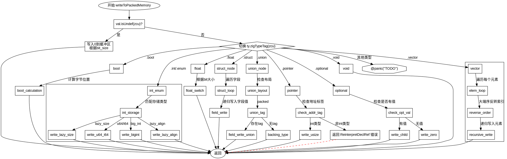

好的，我现在需要为提供的 Zig 函数 `writeToPackedMemory` 绘制一个流程图。首先，我需要理解这个函数的结构和逻辑流程。

首先，函数开始时会检查 `val` 是否为 `Undef`。如果是，则根据类型的位大小写入0到缓冲区，然后返回。如果不是Undef，则根据不同的类型标签（TypeTag）进入不同的处理分支。

接下来，函数处理不同的类型，比如 `bool`、`int`、`enum`、`float`、`vector`、`struct`、`union`、`pointer`、`optional` 等。每个类型有不同的处理方式。例如，对于布尔类型，会根据端序确定字节位置，设置或清除相应的位。对于整型或枚举，会处理不同存储类型的整数（如u64、i64、大整数等），并写入缓冲区。

在处理向量（vector）时，会遍历每个元素，根据端序调整索引，递归调用自身处理每个元素。结构体（struct）则遍历每个字段，依次处理每个字段的值。联合（union）需要根据布局处理不同情况，可能处理特定字段或后备类型。指针和可选类型也有各自的处理逻辑，比如指针需要检查地址标签，可选类型需要处理有值或无值的情况。

还有一些未实现的类型分支，会触发panic。整个流程中有多个错误检查点，比如`ReinterpretDeclRef`和`OutOfMemory`。

为了绘制流程图，需要将每个条件判断和处理分支用节点表示，并用箭头连接流程。需要注意循环结构，例如处理vector时的`while`循环，以及结构体和联合中的字段遍历。此外，递归调用自身的情况也需要在流程图中体现，可能需要用子流程或注释说明。

需要确保每个分支都有正确的连接，例如处理完bool后进入结束，处理int/enum后根据不同的存储类型分支，处理vector时循环每个元素等。同时，错误返回的路径也要标出。

最后，确保流程图符合Graphviz的语法，正确使用节点、边、条件判断框等元素。可能需要使用子图来分组处理不同类型的分支，保持图表清晰。
================================================
