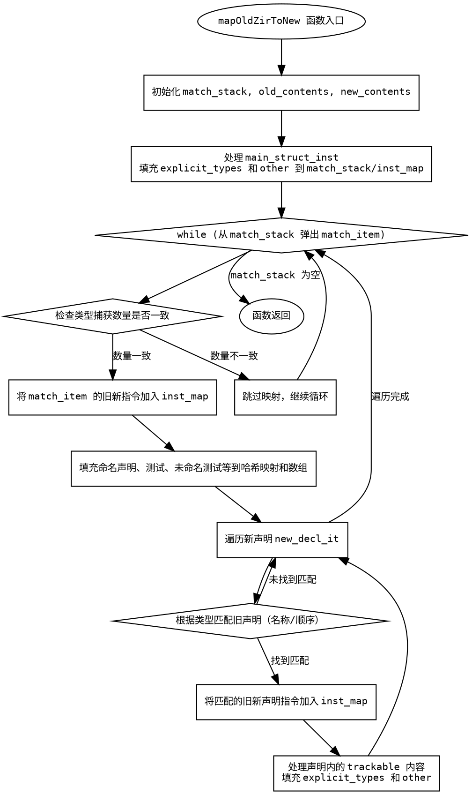

嗯，我需要帮用户用Graphviz画出这个Zig函数的流程图。首先，我得仔细读代码，理解函数的结构和流程。这个函数叫mapOldZirToNew，看起来是用来映射旧ZIR（Zig Intermediate Representation）到新ZIR的指令索引。函数参数包括分配器、新旧ZIR实例和一个指令映射表。

首先，函数内部定义了一个MatchedZirDecl结构体，用来保存新旧指令的索引。然后初始化了一个match_stack的数组来保存这些结构体。接着处理了old_zir和new_zir的trackable root，检查了一些断言，确保主结构指令正确。

接下来，函数处理了explicit_types和other数组，将新旧指令按顺序对应起来，并存入inst_map。然后进入一个循环，从match_stack中弹出元素，检查类型捕获数量是否一致，否则跳过。然后处理命名声明、测试、未命名测试、comptime声明和usingnamespace声明，用不同的方式匹配新旧指令，并更新inst_map。

在循环内部，对于每个新的声明，根据类型进行不同的处理，比如按名称匹配或顺序匹配。然后将对应的旧指令和新指令存入inst_map。之后，查找并处理每个声明中的trackable内容，再次处理explicit_types和other数组，将对应的指令推入match_stack或直接存入inst_map。

整个流程涉及到多个循环和条件判断，需要画出各个步骤之间的流程，包括初始化、处理根节点、循环处理匹配项、处理不同类型的声明等步骤。需要注意条件分支，比如类型捕获数量不匹配时跳过，以及不同声明类型的处理逻辑。

接下来，我需要将这些步骤转化为Graphviz的节点和边。节点表示代码块或判断点，边表示流程走向。可能需要使用子图来组织循环内的处理过程，确保结构清晰。同时，要注意条件判断的分支，如continue的情况，以及不同声明类型的不同处理路径。

可能的结构包括：

1. 函数入口，初始化match_stack、old_contents、new_contents。
2. 处理main_struct_inst，填充match_stack和inst_map。
3. 进入while循环，处理每个match_item。
4. 检查类型捕获数量，若不一致则继续循环。
5. 处理命名声明、测试等，填充不同的哈希映射和数组。
6. 遍历新声明，按类型匹配旧声明，更新inst_map。
7. 处理每个声明中的trackable内容，再次填充match_stack和inst_map。
8. 循环结束，函数返回。

在Graphviz中，用不同的形状表示开始/结束节点、处理步骤、条件判断等。例如，矩形框表示处理步骤，菱形表示条件判断，箭头表示流程方向。需要注意循环的返回点，比如while循环的继续处理下一个match_item。

可能需要将大的处理块分解为子图，特别是处理声明类型的部分，避免节点过多导致图表混乱。同时，确保每个步骤的标签清晰，能够对应到代码的具体部分。

最后，检查是否有遗漏的分支或步骤，确保流程图覆盖所有可能的执行路径，包括错误处理和continue的情况。
================================================

该流程图包含以下关键节点：

1. **函数入口**和变量初始化
2. 主结构体指令处理（填充初始匹配数据）
3. 主循环：处理每个匹配项
   - 类型捕获数量检查
   - 声明匹配逻辑（名称匹配/顺序匹配）
   - 嵌套指令处理
4. 指令映射更新
5. 跟踪内容处理（递归填充新匹配项）

箭头方向表示程序执行流程，菱形节点表示条件判断。通过该图可以清晰看到：
- 主循环的递归匹配机制
- 不同类型声明的匹配策略
- 指令映射的更新路径
- 嵌套内容的处理流程

特别需要注意从 `process_trackable` 回到 `new_decl_loop` 的箭头，表示对每个声明内部内容的递归处理，以及 `match_stack` 的动态更新机制。