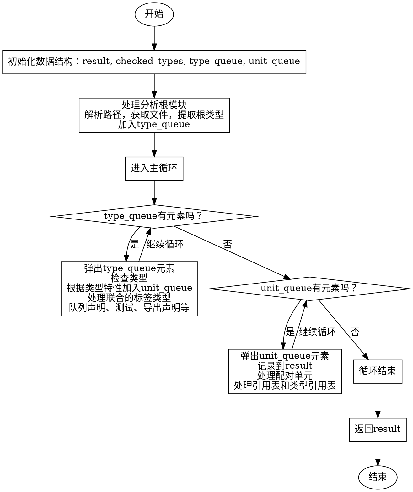

好，我需要为这个Zig函数生成Graphviz的流程图。首先，我得仔细理解这个函数的结构和逻辑流程。

函数名是resolveReferencesInner，返回一个AutoHashMap。看起来像是处理引用解析的内部函数。函数内部有几个主要的数据结构，比如result、checked_types、type_queue、unit_queue等。接下来，函数处理分析根模块，解析路径，获取文件，处理根类型，然后将这些类型加入队列。

然后进入一个大的循环，分为两个主要部分：处理type_queue和unit_queue。处理type_queue时，会根据不同的类型（struct、union、enum等）决定是否将对应的AnalUnit加入unit_queue。同时，处理联合类型的生成标签类型，队列中的声明、测试、导出声明等。处理unit_queue时，会将相关联的单元互相引用，并处理引用表中的所有引用，以及类型引用表中的类型。

接下来，我需要将这些逻辑步骤转化为流程图。流程图应该包括开始节点、结束节点，以及中间的判断和处理步骤。可能的条件分支包括循环处理type_queue和unit_queue，以及各种类型检查和处理逻辑。

需要注意的是，Graphviz使用DOT语言，所以需要正确使用节点和边的定义，条件判断使用菱形节点，处理步骤用矩形节点，开始和结束用椭圆形节点。需要确保所有的循环和条件分支都被正确表示，同时保持流程图的清晰和可读性。

可能会遇到的难点是将复杂的循环和条件分支简化成流程图，而不遗漏关键步骤。另外，函数中有多个队列（type_queue和unit_queue）的处理，需要正确表示它们的交互和转换过程。

现在，我需要将上述分析转化为具体的Graphviz节点和边，确保每个主要步骤和条件都被正确表示，并且流程逻辑正确无误。
================================================
