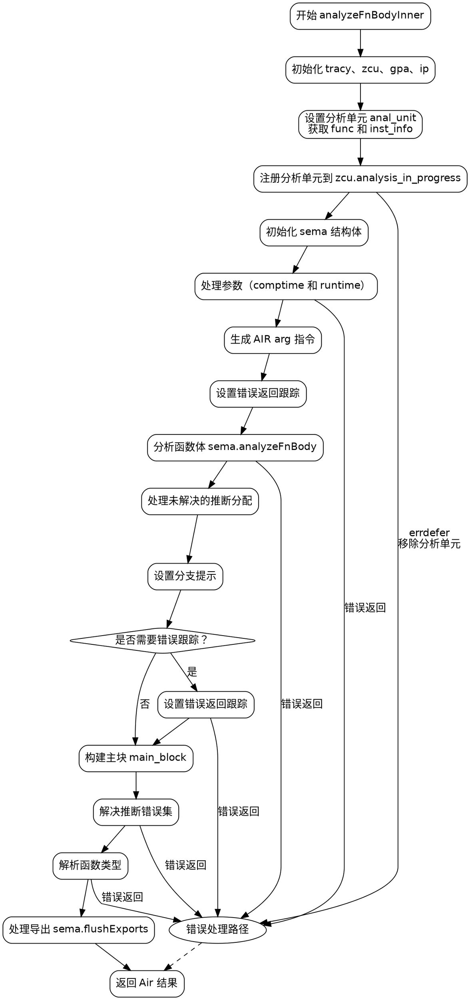

嗯，我需要帮用户用Graphviz画出这个Zig函数的流程图。首先，我得仔细看看这段代码的结构，理解每个部分的作用，然后确定各个流程节点和它们之间的关系。

首先，函数名为analyzeFnBodyInner，返回类型是Zcu.SemaError!Air。函数一开始进行了一些初始化和资源获取，比如tracy跟踪、获取zcu、gpa、ip等。接下来设置分析单元anal_unit，处理函数信息func，获取指令信息inst_info，处理文件zir等。然后通过try zcu.analysis_in_progress.put(gpa, anal_unit, {})开始分析，并在错误处理时移除分析单元。

接下来是函数体的分析，包括设置sema结构体，处理参数、错误追踪、块(block)的初始化，处理泛型函数实例的参数，生成AIR指令等。中间有很多条件判断，比如处理comptime参数、运行时参数，生成arg指令。然后处理错误返回跟踪，分析函数体，解决推断的错误集合，最后处理导出和返回结果。

我需要将这些步骤分解成流程图中的节点。可能的节点包括：

1. 初始化和资源获取（tracy，zcu，gpa，ip）
2. 设置分析单元和函数信息
3. 开始分析并注册错误处理
4. 初始化sema结构体
5. 处理参数（comptime参数和运行时参数）
6. 生成AIR指令中的arg部分
7. 错误返回跟踪设置
8. 分析函数体（sema.analyzeFnBody）
9. 处理未解决的推断分配
10. 设置分支提示
11. 处理错误追踪（如果需要）
12. 构建主块（main_block）
13. 解决推断错误集
14. 解析函数类型
15. 处理导出（sema.flushExports）
16. 返回结果（Air结构体）

接下来需要确定这些步骤之间的流程。例如，初始化后进入分析单元设置，然后是sema初始化，接着处理参数，生成指令，错误处理，分析函数体，处理推断错误，最后返回结果。同时要注意条件分支，比如是否有comptime参数，是否需要设置错误追踪等。

在绘制流程图时，需要将这些步骤用矩形框表示，条件判断用菱形框，箭头表示流程方向。例如，处理参数时，如果有comptime参数，则预填充参数；否则处理运行时参数。错误处理部分可能需要分支，如遇到错误则跳转到错误处理流程。

另外，需要注意函数中的错误处理（errdefer）和可能的异常流程。例如，在开始分析后注册的errdefer会在出错时移除分析单元。

最后，确保流程图的结构清晰，层次分明，覆盖所有主要步骤和条件分支，避免遗漏关键节点。
================================================
