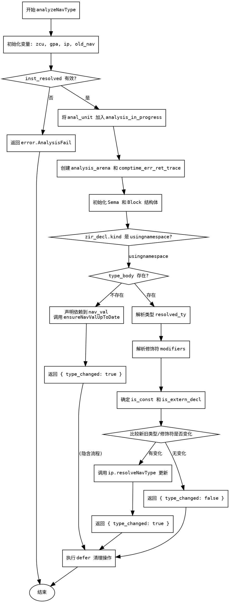

嗯，我需要帮用户用Graphviz画出一个Zig函数的流程图。首先，我得仔细读这个函数，理解它的逻辑流程。这个函数叫做analyzeNavType，看起来是处理类型分析的。

首先，函数开始部分初始化了一些变量，比如zcu、gpa、ip，然后获取旧的导航信息old_nav。接着，检查inst_resolved是否成功，否则返回错误。然后处理文件相关的信息，比如zir。

接下来，函数将当前的分析单元放入analysis_in_progress中，并设置了一个defer来确保之后移除。然后创建了分析用的arena和错误跟踪列表。之后初始化了Sema结构体，并设置了defer来释放资源。

然后，声明依赖关系，处理块（block）的初始化，检查zir_decl的类型，如果是usingnamespace的话。接着处理类型来源ty_src，设置块的原因。

如果type_body不存在，就声明依赖到nav_val，并调用ensureNavValUpToDate，然后返回type_changed为true。否则，继续解析类型，处理修饰符，判断是否常量，是否是外部声明等。

然后比较新旧类型和修饰符是否有变化，如果有变化，就调用resolveNavType更新，并返回type_changed为true，否则返回false。

现在要画流程图，我需要把每个主要的步骤转化为节点，并用箭头连接它们。要注意条件判断的分支，比如是否存在type_body，或者changed是否为真。

可能的步骤节点包括：
1. 初始化变量和获取old_nav。
2. 检查inst_resolved是否有效。
3. 放入analysis_in_progress并设置defer。
4. 创建arena和错误跟踪列表。
5. 初始化Sema和block。
6. 检查zir_decl的类型是否为usingnamespace。
7. 处理type_body存在与否的分支。
8. 解析类型和修饰符。
9. 判断是否const和extern。
10. 比较新旧类型和修饰符是否变化。
11. 根据变化更新或返回结果。

需要注意条件分支，比如type_body是否存在，以及changed的判断。还要处理错误路径，比如返回error.AnalysisFail。

可能需要使用条件判断的菱形节点，然后用箭头表示不同分支的流向。同时，defer操作可能在流程中作为后续步骤处理，但可能不需要单独节点，除非有影响流程的关键点。

现在，根据这些步骤，我需要用Graphviz的语法来构建流程图。节点用矩形，条件判断用菱形，箭头标注yes/no或者条件结果。
================================================
