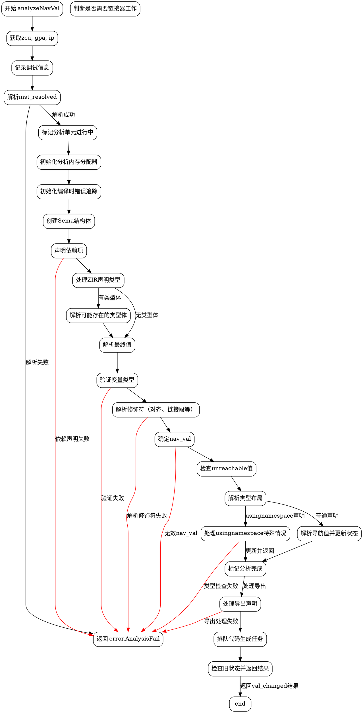

嗯，我需要为这个Zig函数`analyzeNavVal`绘制一个流程图。首先，我得仔细理解这个函数的结构和逻辑流程。看起来这个函数主要负责分析导航值（nav_val），处理类型、值、导出等。

首先，函数开始时会获取一些上下文信息，比如zcu、gpa、ip等。然后定义了一个分析单元anal_unit，记录旧的导航信息old_nav。接着，它检查inst_resolved是否成功解析，如果失败则返回错误。然后获取对应的文件和ZIR数据，并将分析单元标记为进行中，避免重复分析。

接下来，初始化了分析用的内存分配器analysis_arena，以及用于错误追踪的comptime_err_ret_trace。然后创建了Sema结构体，用于语义分析，并声明依赖项。

之后，处理不同类型的声明，比如变量、常量、usingnamespace等。根据是否有类型体或值体，分别处理类型和值的解析。对于外部声明（extern），需要处理库名和外部符号。然后验证类型，处理对齐、链接段、地址空间等修饰符。

在处理完类型和值后，确定最终的nav_val，并进行各种检查，比如是否为unreachable，类型是否正确。对于usingnamespace，特别处理其类型和命名空间。之后，处理链接器工作和代码生成队列，根据旧的状态返回val_changed的结果。

现在，我需要将这些步骤转化为流程图。流程图应该从函数入口开始，按照逻辑分支逐步展开。需要注意条件判断和错误处理的分支，比如错误返回、不同的声明类型处理、外部声明和普通声明的区别，以及最后的代码生成和结果返回。

可能的分支点包括：inst_resolved是否解析成功，zir_decl的类型（如usingnamespace、const、var等），是否有类型体或值体，是否是外部链接，队列代码生成的条件等。每个分支都需要对应的判断节点和流程箭头。

需要注意函数中的错误处理部分，比如errdefer，以及各种条件判断导致的提前返回或继续执行。同时，循环和递归可能需要特殊处理，但在这个函数中似乎没有明显的循环结构，主要是条件分支。

最后，生成流程图时应使用Graphviz的DOT语言，正确表示各个步骤和判断节点，确保逻辑清晰，结构合理。
================================================

这个流程图使用Graphviz的DOT语言绘制，展示了：
1. 主流程的上下文初始化、依赖声明和语义分析阶段
2. 类型/值解析的分支逻辑
3. 特殊声明（usingnamespace/extern）的处理路径
4. 错误处理流程（红色箭头）
5. 最终结果判断和代码生成队列
6. 增量编译状态更新机制

关键判断节点用菱形表示，主要处理步骤用圆角矩形，错误路径用红色箭头标注。流程完整覆盖了函数中的：
- ZIR指令解析
- 类型系统交互
- 内存管理（arena/errdefer）
- 编译期计算
- 交叉编译特性处理
- 导出和代码生成逻辑