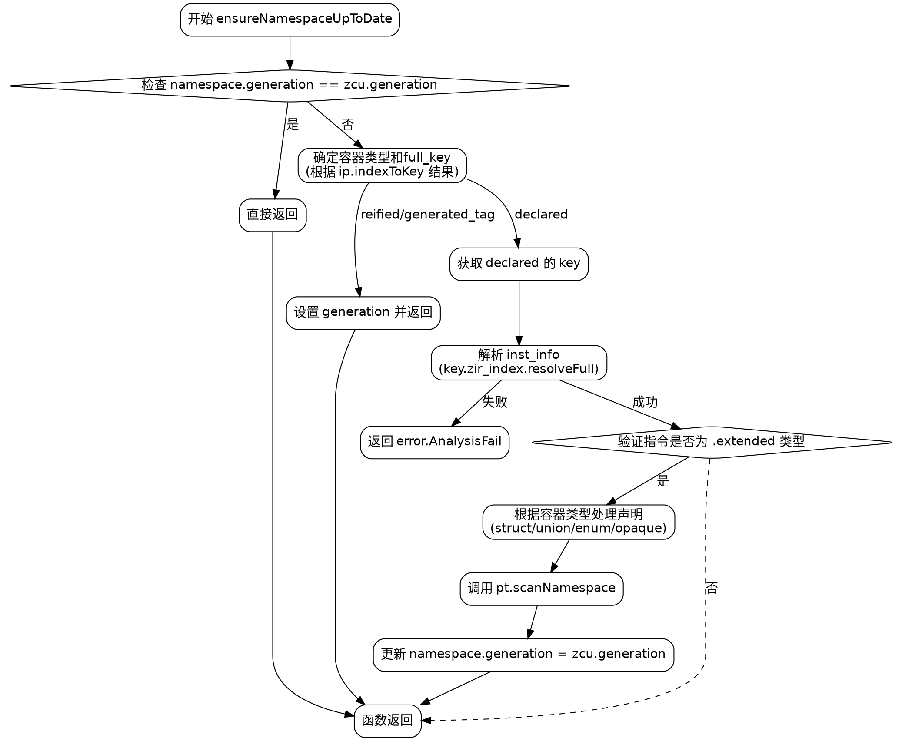

好的，我需要为给定的Zig函数生成一个Graphviz流程图。首先，我需要理解这个函数的结构和逻辑流程。

函数名为`ensureNamespaceUpToDate`，主要作用是确保某个命名空间是最新的。根据代码，函数首先检查命名空间的生成是否与当前Zcu的生成相同，如果相同则直接返回。否则，根据不同的容器类型（struct、union、enum、opaque）处理对应的声明，最后扫描命名空间并更新生成版本。

接下来，我需要将代码分解为流程图的主要步骤：

1. **开始**：函数入口。
2. **检查namespace.generation == zcu.generation**：如果相等，直接返回；否则继续。
3. **确定容器类型和full_key**：通过switch语句处理不同的类型。
4. **处理full_key的不同情况**：如果是reified或generated_tag，设置generation并返回；否则获取declared的key。
5. **获取指令信息inst_info和文件zir**：如果解析失败，返回错误。
6. **验证指令是否为extended类型**：检查指令的tag是否为.extended。
7. **根据容器类型处理不同的声明**：分为struct、union、enum、opaque四种情况，分别提取decls。
8. **扫描命名空间scanNamespace**：调用pt.scanNamespace。
9. **更新namespace.generation**：设置为当前zcu的generation。
10. **结束**：函数返回。

需要注意条件分支，如不同的容器类型处理，以及可能的错误路径（如AnalysisFail）。此外，各个步骤之间的逻辑流向需要正确表示，比如条件判断后的不同分支。

在绘制Graphviz图时，使用节点表示步骤，箭头表示流程方向，条件判断使用菱形节点，并标注条件结果。需要确保所有可能的路径都被覆盖，包括错误返回。

现在根据上述分析，构建Graphviz的dot代码，使用合适的节点形状和标签，正确连接各个步骤。
================================================
