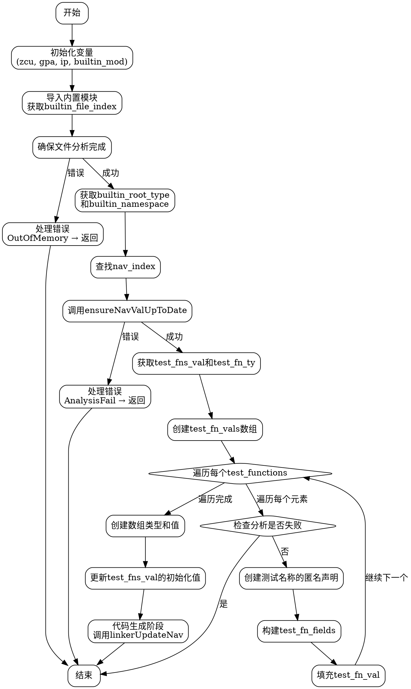

嗯，用户让我用Graphviz来画这个Zig函数的流程图。首先，我需要理解这个函数的结构和逻辑流程。看起来这个函数叫做populateTestFunctions，主要处理测试函数的填充。

首先，函数开始的部分，获取了一些上下文变量，比如zcu、gpa、ip等。然后导入了一个内置模块（builtin_mod），并确保文件分析完成。这部分可能有错误处理，比如处理内存不足的情况。

接下来，获取了builtin_root_type和builtin_namespace，然后通过名称查找nav_index。这里有一个确保导航值更新的块，调用了ensureNavValUpToDate，并处理可能的错误。之后，获取test_fns_val和test_fn_ty，进入数组匿名声明的处理。

在数组匿名声明部分，分配了test_fn_vals，遍历zcu.test_functions，为每个测试函数生成名称和函数指针，构造字段，最后创建数组类型和值。然后构造了一个新的切片指针类型，更新了test_fns_val的初始化值。

最后，进入代码生成阶段，调用linkerUpdateNav，并处理进度节点。

现在需要将这个过程转化为流程图。流程图通常包括开始、结束、处理步骤、判断和循环结构。需要注意的是错误处理的分支，比如遇到AnalysisFail或OutOfMemory时的处理。

可能的步骤：
1. 开始：函数入口。
2. 初始化变量（zcu, gpa, ip等）。
3. 导入builtin_mod并获取文件索引。
4. 确保文件分析完成，处理可能的错误。
5. 获取builtin_root_type和namespace。
6. 查找nav_index。
7. 确保导航值更新（ensureNavValUpToDate），处理错误。
8. 获取test_fns_val和test_fn_ty。
9. 创建test_fn_vals数组，遍历每个测试函数：
   a. 检查是否分析失败，如果是则返回。
   b. 创建测试名称的匿名声明。
   c. 构建test_fn_fields。
   d. 填充test_fn_val。
10. 创建数组类型和值。
11. 创建新的切片指针类型并更新初始化值。
12. 代码生成阶段，调用linkerUpdateNav。
13. 结束。

需要注意循环结构，比如遍历test_functions的循环。错误处理的分支可能需要条件判断节点。

在Graphviz中，使用节点表示步骤，箭头表示流程方向。条件判断使用菱形节点，循环用箭头返回。可能需要将某些步骤分组，比如错误处理的部分。

现在需要将这些步骤转化为Graphviz的DOT语言结构，确保逻辑正确，流程清晰。
================================================

该流程图通过以下步骤描述函数逻辑：
1. **初始化上下文变量**并导入内置模块
2. **错误处理分支**处理潜在的内存不足或分析失败
3. 通过命名空间查找导航索引并**确保导航值更新**
4. **遍历所有测试函数**，为每个函数生成元数据
5. **聚合测试函数数据**到数组并更新切片指针
6. 最终进入**代码生成阶段**完成处理
7. 整个流程包含明确的错误处理路径和循环结构，使用菱形节点表示条件判断，矩形节点表示操作步骤。