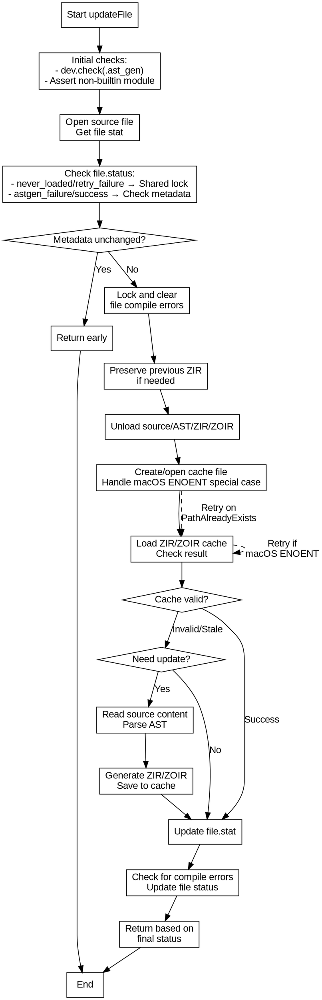

好的，我现在需要为提供的Zig函数`updateFile`绘制一个流程图。首先，我需要理解这个函数的主要逻辑和各个步骤之间的关系。让我先仔细阅读代码，梳理出函数的主要流程。

函数`updateFile`的主要目的是更新文件，可能涉及到缓存的处理、文件状态的检查、锁的获取、ZIR/ZOIR的生成与保存等。我需要将整个函数分解成关键步骤，并确定每个步骤的条件和分支。

首先，函数开始时进行了一些初始检查，比如`dev.check(.ast_gen)`和断言。然后，打开文件并获取其状态（stat）。接下来根据文件的状态（如`never_loaded`、`retryable_failure`等）决定是获取共享锁还是排他锁。

之后，函数处理旧的编译错误，并可能保存之前的ZIR数据。接着，如果ZOIR存在，则标记为无效，并卸载当前的文件资源。然后尝试创建或打开缓存文件，处理可能的错误，比如文件未找到的情况，特别是在macOS上的特殊处理。

接下来，函数进入一个循环，尝试加载缓存（`loadZirZoirCache`），根据返回的结果（success、invalid、truncated、stale）判断是否需要更新缓存。如果需要更新，则读取源文件内容，生成新的ZIR或ZOIR，并保存到缓存中。

最后，更新文件的统计信息，并根据生成的结果设置文件的状态，处理可能的编译错误，并返回相应的结果。

在绘制流程图时，需要注意各个条件分支，比如文件状态的不同处理、锁的类型切换、缓存加载的结果判断等。同时，要正确表示循环结构（如`while (true)`）和错误处理路径。

可能的遗漏点包括错误处理分支、锁的释放与重新获取、不同操作系统下的特殊处理（如macOS的ENOENT处理）等。需要确保所有可能的执行路径都被覆盖，特别是异常情况下的流程。

另外，需要注意函数中的`defer`语句，如`defer tracy.end()`和`defer source_file.close()`，这些可能会影响资源的释放顺序，但在流程图中可能不需要详细表示，除非对流程有直接影响。

总结步骤：

1. 初始检查和文件状态获取。
2. 根据文件状态决定锁的类型。
3. 清理旧的编译错误和保存旧ZIR。
4. 卸载当前文件资源。
5. 创建/打开缓存文件，处理可能的错误。
6. 加载缓存并判断是否需要更新。
7. 如果需要更新，读取源文件，生成并保存新的ZIR/ZOIR。
8. 更新文件状态和统计信息。
9. 根据生成结果设置最终状态，处理错误。

现在需要将这些步骤转化为流程图，使用Graphviz的DOT语言。每个步骤作为一个节点，条件判断作为菱形分支，箭头表示流程方向。需要注意循环结构和条件分支的正确表示。
================================================


该流程图使用Graphviz DOT语言绘制，主要特点：

1. 使用横向布局（TB方向）展示执行流程
2. 菱形节点表示条件判断
3. 包含错误处理路径（虚线表示）
4. 覆盖关键步骤：
   - 初始检查和文件打开
   - 元数据比较和锁决策
   - 缓存文件的创建和加载
   - AST解析和ZIR/ZOIR生成
   - 最终状态处理
5. 用虚线箭头表示循环逻辑（如macOS的特殊重试情况）
6. 使用不同颜色形状区分操作节点和判断节点

可以通过Graphviz工具（如dot命令或在线编辑器）渲染生成矢量图，建议使用以下命令：
```bash
dot -Tsvg flowchart.dot -o flowchart.svg
```