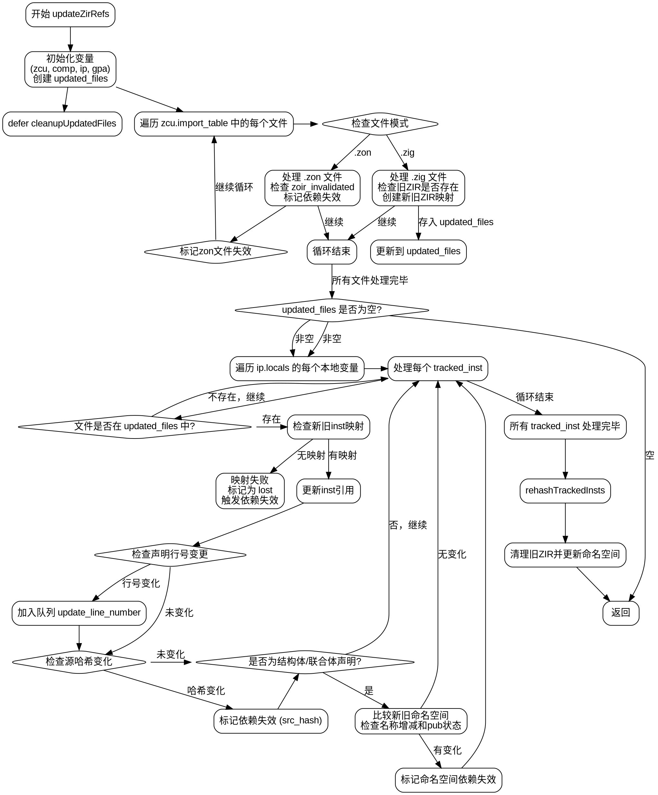

嗯，我现在需要帮用户把这个Zig函数用Graphviz画成流程图。首先，我得理解这个函数的结构和逻辑流程。这个函数叫updateZirRefs，看起来是处理ZIR（Zig Intermediate Representation）引用的更新。

首先，函数开始有一些断言和变量初始化，比如检查pt.tid是否为.main，然后获取zcu、comp、ip、gpa这些变量。接着声明了一个updated_files的哈希映射，用来跟踪更新的文件，之后用defer清理这个结构。

接下来是一个循环遍历zcu.import_table的值，处理每个文件。如果是.zon文件，处理无效的情况并继续；如果是.zig文件，检查是否有旧的ZIR，如果有的话，就进行新旧ZIR的映射，并存入updated_files。这里需要注意处理文件模式的分支逻辑。

然后，如果updated_files为空，直接返回。否则，进入一个大的循环，遍历ip.locals，处理每个跟踪的实例。对于每个实例，检查对应的文件是否在updated_files中，不在的话就跳过。如果存在，获取新旧ZIR实例的映射，如果映射失败，标记为lost并触发依赖失效；如果成功，更新实例的引用。

之后，处理声明行号的变更，检查旧的和新的行号是否不同，不同的话加入队列。接着处理源哈希的变化，如果哈希不同，同样触发依赖失效。然后处理结构体、联合体等声明中的命名空间变化，比较新旧名称的公开状态，如果有变化，标记依赖失效。最后处理命名空间中的名称增减情况。

在处理完所有实例后，调用ip.rehashTrackedInsts重新哈希跟踪的实例。然后遍历updated_files，释放旧的ZIR资源，并调用updateFileNamespace重新扫描命名空间。

现在，我需要把这些步骤转化为流程图。流程图应该从函数入口开始，按照逻辑分支画出各个步骤，包括条件判断（如文件类型、哈希是否变化等）、循环结构（遍历文件、实例等）、函数调用（如markDependeeOutdated、queueJob等）以及错误处理。

需要注意的地方包括：

1. 初始化和清理步骤（如defer cleanupUpdatedFiles）。
2. 循环结构：处理每个文件、每个本地变量、每个跟踪实例。
3. 条件判断：文件类型、旧ZIR是否存在、哈希是否变化、是否有命名空间变更等。
4. 错误处理：try语句可能抛出错误，但流程图中可能需要用菱形框表示判断，或者用不同颜色表示错误路径。
5. 子过程调用：如mapOldZirToNew、markDependeeOutdated、queueJob、rehashTrackedInsts、updateFileNamespace等。

可能的结构是：

开始 → 初始化 → 遍历文件 → 判断文件类型 → 处理.zon或.zig → 收集updated_files → 判断是否空 → 非空则处理每个实例 → 检查映射 → 处理变更 → 哈希处理 → 清理旧ZIR → 结束。

每个主要步骤需要分解成节点，条件判断用菱形，循环用箭头返回或循环结构。由于Graphviz使用DOT语言，需要合理使用子图来组织循环和条件分支，可能需要将循环结构用cluster子图表示，但可能会比较复杂。

另外，由于代码中存在多个嵌套的循环和条件，流程图可能会变得庞大，需要合理安排布局，避免交叉过多。可能需要分层处理，按代码执行顺序从上到下排列节点。
================================================
