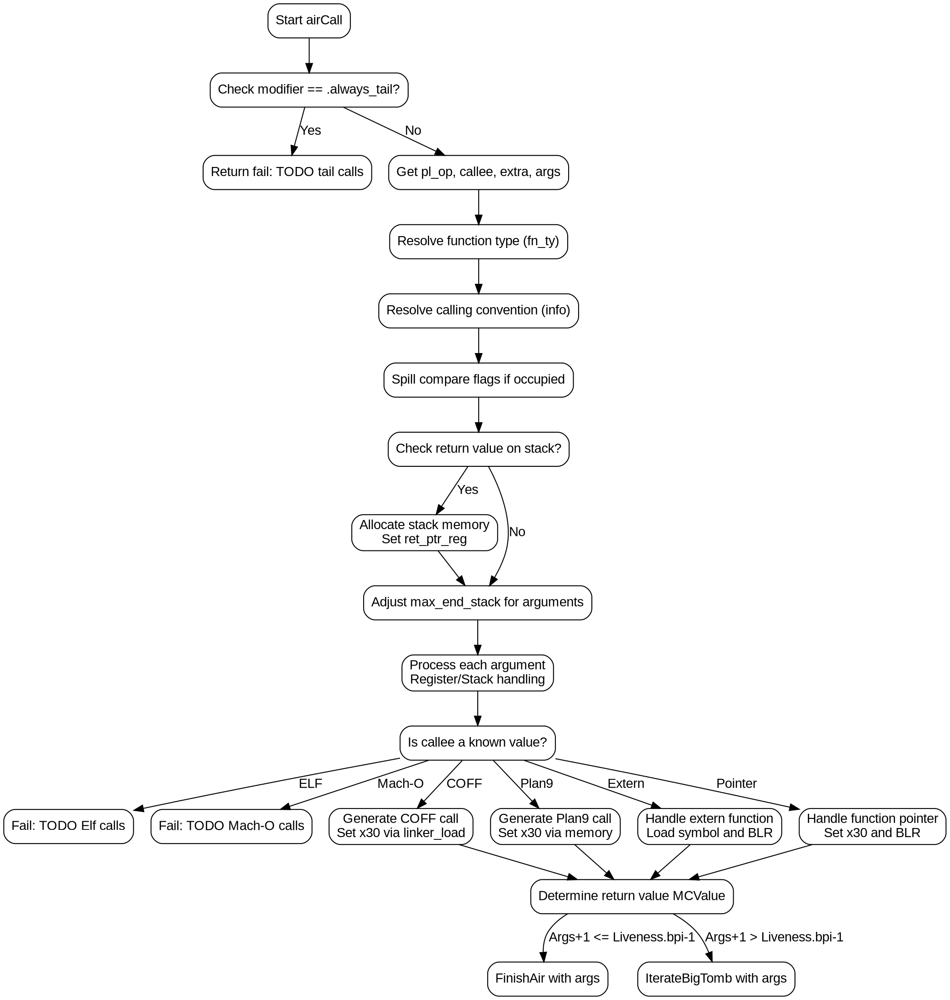

好的，我现在需要为提供的Zig代码中的`airCall`函数绘制流程图。首先，我得仔细阅读代码，理解每个步骤的逻辑流程，然后将其转化为图形化的流程图。

首先，函数开始于检查`modifier`是否为`.always_tail`，如果是，则返回错误，因为尚未实现尾部调用。接着获取`pl_op`、`callee`、`extra`等信息，解析参数和类型。

然后，代码处理调用约定和返回值。如果返回值是通过栈传递的，分配内存空间，并设置寄存器。接着处理参数，根据参数的类型和位置，将参数放入寄存器或栈中。

之后，根据不同的二进制文件格式（如ELF、Mach-O、COFF等）生成不同的调用指令。如果是外部函数，处理符号索引和加载方式。最后处理函数调用的结果，保存返回值到适当的寄存器，并根据参数数量处理`finishAir`或`iterateBigTomb`。

在绘制流程图时，需要将这些步骤分解成不同的节点，并用条件判断连接起来。例如，检查`modifier`、处理返回值的位置、不同的二进制文件处理分支等。

需要注意条件分支的正确连接，比如`if (modifier == .always_tail)`会导致提前返回，之后的步骤可能不会执行。处理参数时的循环结构，以及不同文件格式的分支处理。

还要注意函数中的错误处理，例如`try`可能会跳转到错误处理，但流程图中可能需要简化这些部分，或者用节点表示可能的错误路径。

最后，生成流程图时，使用正确的图形符号，如矩形表示处理步骤，菱形表示条件判断，箭头表示流程方向。确保每个步骤清晰，逻辑正确，没有遗漏关键判断点。
================================================
