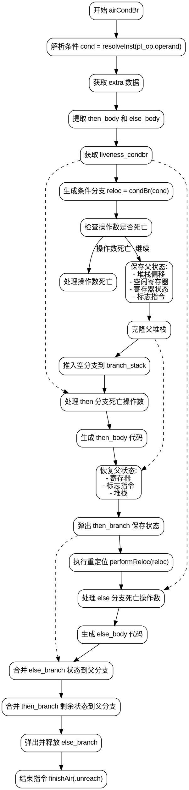

嗯，我需要为这个Zig函数`airCondBr`绘制一个流程图。首先，我得理解这个函数的结构和逻辑流程。函数看起来处理条件分支，生成相应的代码，包括处理条件、生成then和else分支，合并分支后的状态等。

首先，函数开始于获取指令的数据，解析条件，然后处理条件分支。接着保存当前状态（如堆栈偏移、寄存器状态等），生成then分支的代码，恢复状态，处理else分支，最后合并两个分支的状态。

我应该分步骤来分解这个过程。首先处理条件，保存父分支的状态，生成then分支，恢复父状态，生成else分支，然后合并两者的状态差异。此外，还有一些资源管理和错误处理的步骤，比如`defer`语句和错误返回。

需要注意函数的控制流，比如`try`可能会跳转到错误处理，但在这个上下文中，可能不需要在流程图中详细展示错误路径，除非特别重要。另外，循环和条件判断也需要在流程图中体现，例如处理then和else体中的死亡操作数，合并分支时的循环遍历条目。

可能的结构是：开始→解析条件→保存父状态→生成then分支→恢复父状态→生成else分支→合并两个分支的状态→结束。中间会有分支处理死亡的操作数，以及资源释放的步骤。

需要确保流程图的节点包括所有关键步骤，如条件解析、状态保存、生成then/else体、状态恢复、合并inst_table条目、资源释放等。同时，条件判断如`if (self.liveness.operandDies(...))`也需要作为判断节点出现。

最后，可能需要处理一些细节，比如`performReloc`和`finishAir`的调用，以及确保流程图的连贯性和正确性，避免遗漏步骤或顺序错误。
================================================
