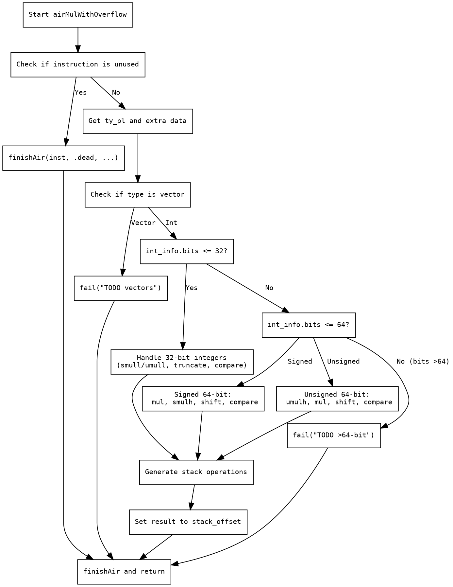

好的，我现在需要为提供的Zig函数`airMulWithOverflow`生成一个Graphviz的流程图。首先，我得仔细阅读并理解这个函数的逻辑结构。

函数的主要目的是处理乘法溢出操作，根据不同的整数类型（比如32位、64位等）生成相应的机器码。看起来函数分为几个主要分支：

1. **处理未使用的指令**：如果当前指令未被使用，直接标记为dead并返回。
2. **向量类型检查**：如果是向量类型，返回未实现的错误。
3. **整数类型处理**：
   - **小于等于32位的情况**：使用`smull`或`umull`指令，处理结果截断，比较是否溢出。
   - **64位及以下的情况**：分为有符号和无符号处理，使用`mul`和`smulh`/`umulh`指令，进行移位和比较来判断溢出。
   - **超过64位的整数**：返回未实现的错误。

接下来，我需要将这些逻辑步骤转化为流程图的结构。流程图通常以开始节点开始，然后是条件判断，不同的分支处理，最后结束节点。

可能的步骤：
- 开始节点：函数入口。
- 检查指令是否未被使用，如果是，结束返回dead。
- 检查是否是向量类型，如果是，报错。
- 否则，进入整数处理分支。
  - 判断整数位数是否<=32位，进入相应的处理流程。
  - 否则判断是否<=64位，进入64位处理。
  - 否则报错未实现。
- 每个处理流程内部可能有多个步骤，如分配内存、生成指令、设置栈等。
- 最终返回结果。

需要注意的是，Graphviz使用节点和边来表示流程，条件判断使用菱形节点，处理步骤用矩形节点。需要正确连接各个条件分支，避免遗漏可能的路径。

现在，我需要将上述分析转化为具体的Graphviz代码。确保每个判断分支都有对应的节点和箭头，处理步骤详细但不冗余。
================================================
