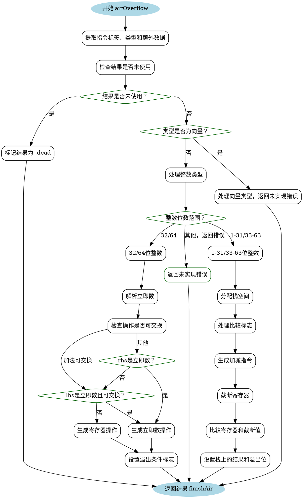

好的，我需要为提供的Zig函数`airOverflow`生成Graphviz的流程图。首先，我需要理解这个函数的结构和逻辑流程。

1. **函数入口**：函数开始于`airOverflow`的定义，处理溢出操作。
2. **变量初始化**：提取指令标签、类型和额外数据，获取相关的类型和参数。
3. **结果判断**：检查结果是否未使用，如果是则标记为dead，否则进入主要逻辑。
4. **处理向量类型**：如果是向量类型，返回未实现的错误。
5. **整数类型处理**：
   - **小整数（1-31, 33-63位）**：
     - 分配栈空间。
     - 处理比较标志。
     - 生成加减指令。
     - 截断寄存器并比较。
     - 设置栈上的结果和溢出位。
   - **32和64位整数**：
     - 处理立即数的情况。
     - 生成相应的汇编指令。
     - 根据有无溢出设置条件标志。
6. **返回结果**：结束并返回结果。

接下来，我需要将这些步骤转化为流程图节点，并用条件分支连接它们。需要注意不同情况的分支，如整数位数不同时的处理，以及立即数的判断。同时，需要处理异常情况和未实现的功能，如向量类型的错误返回。

确保流程图的每个判断点都有明确的分支，比如`switch`语句的不同情况，以及条件判断如`if (lhs_immediate_ok)`等。使用菱形表示判断节点，矩形表示处理步骤，椭圆形表示开始和结束。

最后，使用Graphviz的语法结构将这些元素组织起来，确保箭头正确指向，逻辑清晰。
================================================
