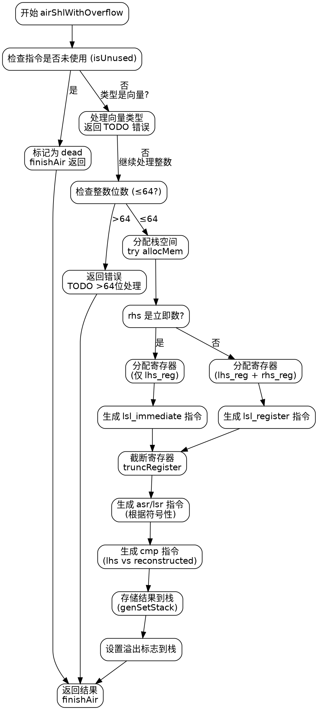

好的，我需要为提供的 Zig 函数 `airShlWithOverflow` 生成一个 Graphviz 的流程图。首先，我需要仔细阅读并理解这段代码的结构和逻辑。

首先，函数开始部分获取了指令的数据类型和操作数，检查指令是否被使用，如果未被使用则标记为 dead。接着，处理了向量的情况，但目前未实现。然后针对整数类型进行处理，分成了两种情况：立即数移位和寄存器移位。每种情况下都会分配寄存器，生成相应的汇编指令，进行截断操作，然后比较原始值和移位后的值是否相等，以判断是否溢出。最后将结果存储在栈上，并返回。

接下来，我需要将这个过程分解成流程图中的各个节点和判断分支。可能的节点包括：

1. 开始：函数入口。
2. 检查指令是否被使用，如果是，标记为 dead 并结束。
3. 处理向量类型，返回错误（TODO）。
4. 处理整数类型，检查位数是否超过 64，超过则返回错误。
5. 分配栈空间。
6. 处理立即数移位和寄存器移位的分支。
7. 生成对应的汇编指令（lsl_immediate 或 lsl_register）。
8. 截断寄存器。
9. 生成 asr/lsr 指令。
10. 比较原始值和重构后的值。
11. 将结果存储到栈。
12. 结束：返回结果。

需要注意条件分支，比如立即数是否存在，整数位数是否超过64，以及符号性决定使用 asr 还是 lsr。此外，流程图中应包含判断节点和相应的流程走向。

最后，使用 Graphviz 的 DOT 语言将这些步骤和判断连接起来，确保逻辑正确，没有遗漏关键步骤。
================================================
