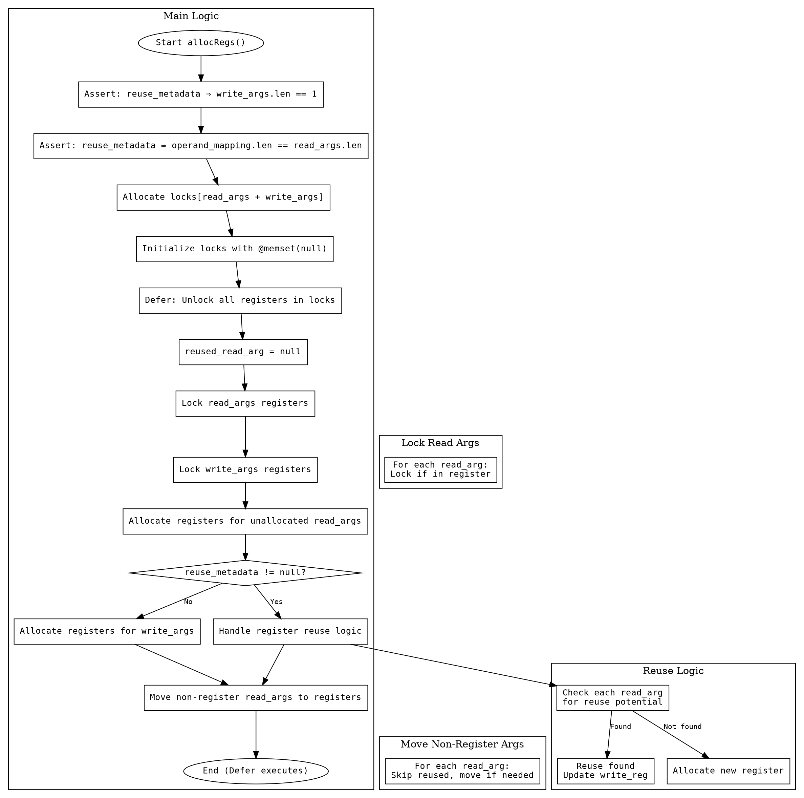

嗯，用户让我用Graphviz来画这个Zig函数的流程图。首先，我需要理解这个函数的结构。函数名为allocRegs，主要处理寄存器的分配，包括读取参数和写入参数的寄存器分配，以及可能的复用元数据。

首先，函数开始有两个断言检查，确保当reuse_metadata存在时，写入参数的数量为1，且操作数映射长度与读取参数长度一致。这部分应该在流程图中作为条件判断节点。

接下来，函数分配了一个锁数组locks，分为读取锁和写入锁。之后用@memset初始化为null，并在最后释放锁。这部分涉及内存分配和释放，应该在流程图中体现为分配和释放的步骤。

然后，处理reused_read_arg变量，用于跟踪被复用的读取参数。之后，函数遍历读取参数，锁定已分配到寄存器的参数。同样，遍历写入参数，锁定需要绑定的寄存器。这部分需要循环结构来表示遍历过程。

接着，为尚未分配寄存器的参数分配寄存器，这里可能涉及到条件判断，如果参数已经绑定到寄存器，则直接使用，否则分配新寄存器并加锁。这部分需要分支节点和循环。

当reuse_metadata存在时，处理复用逻辑，尝试复用读取参数的寄存器作为写入目标。这里有一个循环遍历读取参数，检查是否可以复用，如果成功则设置相关变量，否则分配新寄存器。这部分比较复杂，需要条件判断和循环结构。

如果reuse_metadata不存在，则直接为每个写入参数分配寄存器。这部分也是一个循环结构。

最后，处理需要从非寄存器移动到寄存器的读取参数，更新MCValue，并生成设置寄存器的指令。这里同样涉及循环和条件判断，特别是当参数被复用时需要跳过。

在画流程图时，需要注意各个条件判断的分支，循环结构，以及各个步骤之间的顺序。可能需要使用子图来分组不同的处理阶段，比如初始化、锁定寄存器、分配寄存器、处理复用、移动数据等。

需要确保节点之间的箭头正确表示执行顺序，条件判断使用菱形节点，处理步骤使用矩形节点，开始和结束使用椭圆形。同时，注意处理错误情况的路径，但根据代码中的try，错误可能会直接返回，所以在流程图中可能不需要特别处理错误路径，除非用户特别要求。

可能存在的难点是处理复用逻辑的循环和条件分支，需要仔细分析代码逻辑，确保每个条件分支都被正确表示。此外，锁的分配和释放流程也需要正确体现，尤其是在defer语句中的释放操作，应该在流程图的末尾部分表示。

总结下来，流程图的大致结构是：

1. 开始
2. 断言检查
3. 分配locks数组
4. 初始化并设置defer释放锁
5. 锁定已分配的读取参数寄存器
6. 锁定已分配的写入参数寄存器
7. 分配未分配的读取参数寄存器
8. 处理reuse_metadata的情况
   a. 尝试复用读取参数作为写入目标
   b. 成功则设置相关变量，否则分配新寄存器
9. 处理无reuse_metadata的情况，分配写入寄存器
10. 处理需要移动的读取参数，更新MCValue并生成指令
11. 结束，释放锁

每个步骤中的循环和条件判断需要详细展开，确保逻辑正确。
================================================

该流程图使用以下约定：
1. 菱形节点表示条件判断
2. 矩形节点表示操作步骤
3. 椭圆节点表示开始/结束
4. 子图展示关键逻辑块的内部细节
5. 虚线框表示逻辑分组，实际执行流程通过主流程箭头连接
6. 包含：
   - 初始断言检查
   - 寄存器锁定阶段
   - 寄存器分配阶段
   - 寄存器复用逻辑
   - 最终移动非寄存器参数阶段
   - 自动解锁的defer机制表示在结束节点执行