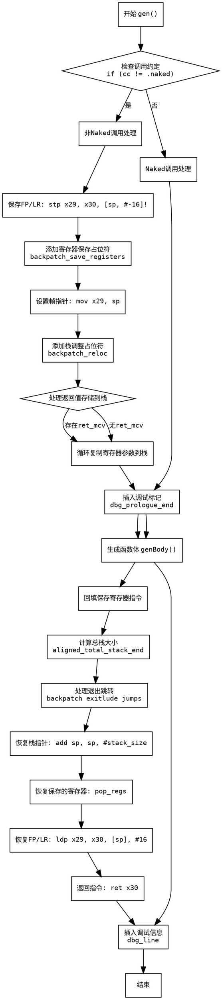

好的，我现在需要为提供的Zig代码中的`gen`函数绘制流程图。首先，我需要仔细阅读代码，理解其结构和逻辑流程。

首先，函数`gen`开始处检查调用约定`cc`是否为`.naked`。如果不是，则执行一系列栈帧设置、保存寄存器、生成函数体、处理返回值和退出处理等步骤。如果调用约定是`.naked`，则跳过这些步骤，直接生成函数体并处理调试信息。

接下来，我需要将代码分解为主要的流程节点：

1. **入口点**：函数开始，检查`cc != .naked`。
2. **非Naked调用处理**：
   - 保存帧指针和链接寄存器（stp指令）。
   - 保存其他寄存器（占位符，后续回填）。
   - 设置帧指针（mov fp, sp）。
   - 调整栈指针（sub sp, sp, #reloc，占位符回填）。
   - 处理返回值存储到栈。
   - 将寄存器参数复制到栈。
   - 生成函数体（genBody）。
   - 回填保存寄存器的指令。
   - 计算总栈大小并调整栈指针。
   - 处理退出跳转（exitlude jumps）。
   - 恢复栈指针和寄存器（pop指令）。
   - 恢复帧指针和链接寄存器（ldp指令）。
   - 返回（ret指令）。
3. **Naked调用处理**：
   - 直接生成函数体。
4. **公共结束部分**：
   - 添加调试信息（dbg_line）。

需要注意条件判断和循环结构，例如`if (cc != .naked)`的分支，以及处理参数时的循环。另外，回填操作（backpatch）需要正确表示占位符被后续替换的过程。

在绘制流程图时，使用不同的形状表示不同操作：菱形表示条件判断，矩形表示操作步骤，箭头表示流程方向。确保每个分支路径清晰，特别是非Naked和Naked调用的不同处理路径。

可能存在的错误点包括：
- 忽略回填步骤的表示。
- 没有正确展示循环结构（例如处理参数的循环）。
- 条件判断的分支不明确。
- 遗漏公共结束部分的调试信息添加。

需要确保所有代码路径都被覆盖，并且流程图结构准确反映代码逻辑。
================================================
