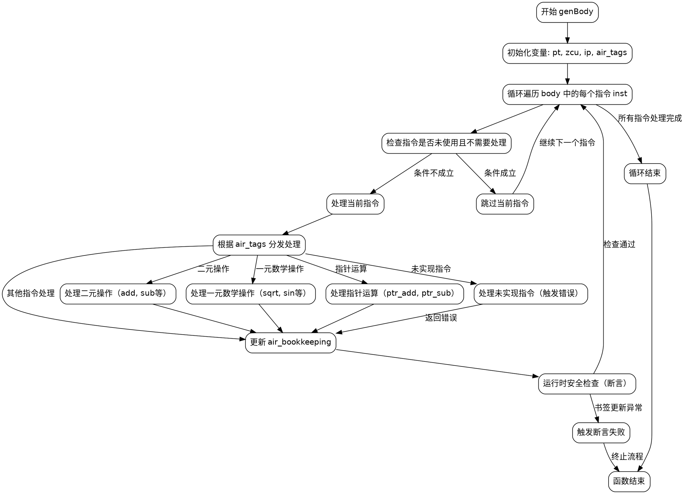

嗯，我现在需要为这个Zig函数genBody生成一个Graphviz的流程图。首先，我得仔细看一下这个函数的结构。函数开始的时候有一些变量的初始化，然后是一个循环遍历body参数中的每个指令。在循环里，首先检查指令是否未被使用且不需要被处理，如果是的话就跳过。接着处理各种不同的AIR指令，每个指令对应不同的处理方法，比如airBinOp、airUnaryMath等等。还有一些未实现的指令会触发错误，比如返回fail或者panic。

流程图应该从函数的入口开始，然后进入循环处理每个指令。循环内部需要判断是否跳过当前指令，然后根据不同的指令类型执行不同的处理分支。处理完后，可能会有错误检查或者书签保持。最后循环结束，函数返回。

需要注意的点是，每个switch的分支可能有很多情况，但流程图不需要详细列出每一个case，而是可以归类为不同的处理步骤，比如“处理二元操作”、“处理一元数学操作”、“处理未实现指令”等。另外，错误处理和书签保持的部分也要在流程图中体现出来。

可能需要的主要节点包括：开始、循环开始、判断是否跳过指令、处理不同指令类型、错误处理、循环结束。边应该根据逻辑连接这些节点，比如循环处理完一个指令后回到循环开始，或者处理失败时进入错误节点。

还要注意函数末尾的断言和运行时安全检查，这些也应该在流程图中有所体现，比如在循环结束后检查寄存器是否被正确释放，或者在处理指令后检查书签是否正确更新。

总之，流程图的结构大概是：开始 -> 初始化变量 -> 进入循环 -> 判断是否跳过指令 -> 处理指令 -> 检查书签和错误 -> 继续循环或结束循环 -> 结束函数。其中处理指令的部分需要分支到不同的处理逻辑，但可以合并为几个主要类别，避免过于详细。
================================================
