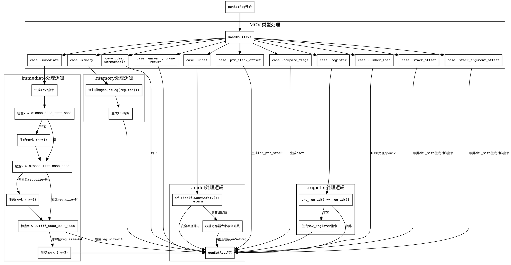

嗯，我现在需要为给定的Zig函数`genSetReg`生成一个Graphviz的流程图。首先，我需要理解这个函数的结构和各个分支。

函数`genSetReg`处理不同类型的`MCValue`，每个case对应不同的处理逻辑。比如，对于`.immediate`，它会生成不同的指令（movz和可能的movk）。而对于`.register`，如果源寄存器和目标寄存器不同，则生成mov指令。其他情况如`.memory`、`.stack_offset`等也有各自的处理步骤。

流程图应该从函数入口开始，然后根据`mcv`的不同值分支出不同的处理路径。每个分支内部可能有条件判断，比如检查寄存器大小或者立即数的不同部分是否为非零，从而决定是否添加movk指令。另外，有些分支会递归调用`genSetReg`，比如`.undef`和`.memory`的情况。

需要注意的是，某些case中可能包含多个条件判断，比如`.immediate`处理中，根据不同的位域判断是否生成movk指令。这些都需要在流程图中体现出来。

另外，对于错误处理和未实现的情况，比如`unreachable`或者`self.fail`，也应该在流程图中标注，可能作为终止节点。

现在，我需要将所有这些逻辑转化为Graphviz的节点和边。每个switch case作为一个分支节点，内部的条件判断作为子节点。递归调用的情况可能需要连接到现有的节点，或者创建新的节点。

可能的结构是：

1. 函数入口节点。
2. 根据`mcv`的类型分支出不同的case节点。
3. 每个case节点内部处理具体的逻辑，包含条件判断和相应的操作。
4. 结束节点或跳转到其他节点（如递归调用）。

需要确保所有可能的路径都被覆盖，并且条件判断正确连接。比如，在`.immediate`中，每个位检查都会决定是否生成movk指令，因此会有多个条件分支。

此外，需要注意节点之间的箭头方向，正确反映程序的控制流。例如，处理完一个case后，流程会继续到函数结束，或者在递归调用时跳转到入口节点。

现在，我需要将这些思考整理成Graphviz的语法，使用节点和边来表示各个步骤和判断。
================================================
