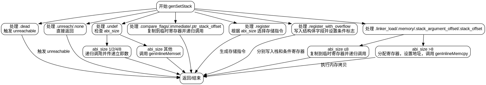

好的，我需要为提供的Zig函数`genSetStack`生成一个Graphviz的流程图。首先，我需要理解这个函数的结构和逻辑流程。

函数开始部分处理不同的`mcv`（可能是一个表示中间代码值的枚举类型）。首先，处理`.dead`、`.unreach`、`.none`的情况，直接返回或触发错误。接着处理`.undef`，根据`abi_size`的不同生成不同的立即数，或者调用`genInlineMemset`。

然后是处理`.compare_flags`、`.immediate`、`.ptr_stack_offset`的情况，这里会将值复制到临时寄存器，并递归调用`genSetStack`。

对于`.register`的情况，根据`abi_size`选择合适的存储指令（如`strb_stack`、`strh_stack`、`str_stack`），并生成相应的汇编指令。

接下来是`.register_with_overflow`的情况，这里需要处理结构体的两个字段，分别写入栈的不同位置，并设置条件标志。

处理`.linker_load`、`.memory`、`.stack_argument_offset`、`.stack_offset`时，分为两种情况：`abi_size`小于等于8时使用临时寄存器，否则调用内存复制函数。这里涉及到分配寄存器、设置源地址和目标地址，最后调用`genInlineMemcpy`。

现在，我需要将这些逻辑转化为流程图。流程图中的每个节点代表一个条件分支或操作步骤。需要注意各个分支的走向，尤其是递归调用和不同情况的分支。

可能的步骤包括：

1. 函数入口。
2. 根据`mcv`的不同进入不同的分支。
3. 处理`.undef`时，根据`abi_size`选择不同的路径。
4. 处理其他情况时，可能的递归调用或生成指令。
5. 处理大块内存时的内存复制流程。

需要注意条件判断的嵌套结构，比如在`.undef`中有内部的`switch`，在`.linker_load`等情况下又有内部的条件判断。

在绘制Graphviz图时，使用节点表示每个判断或操作，用箭头表示流程的转移。可能需要使用子图来组织复杂的分支结构，确保逻辑清晰。

现在，我需要将这些步骤具体化为Graphviz的节点和边，确保每个条件分支都被正确表示，并且流程连贯。
================================================

该流程图使用 Graphviz 的 DOT 语言绘制，主要特点：

1. 使用矩形圆角节点表示不同处理分支
2. 根据 switch(mcv) 的不同匹配项分为 7 个主分支
3. 对.undef 和.linker_load/等分支进行二次细分
4. 使用相同层级(rank=same)保持结构对齐
5. 箭头标注关键操作说明
6. 包含递归调用路径（如 undef_small 的循环箭头未完全展开）
7. 处理大尺寸内存时显示内存拷贝路径
8. 使用不同颜色组区分主分支和子分支（实际渲染时可添加颜色属性）