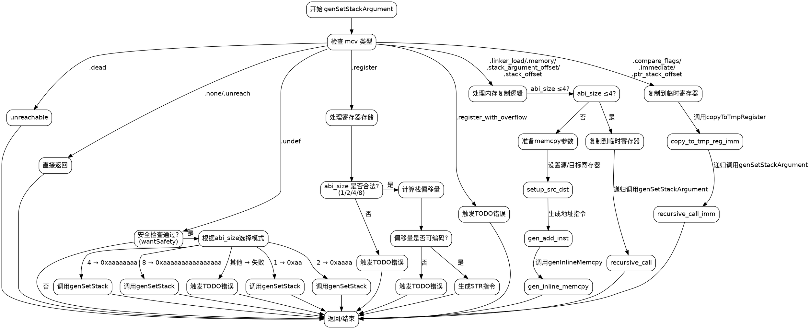

好的，我需要为提供的 Zig 函数 `genSetStackArgument` 生成一个 Graphviz 的流程图。首先，我需要理解这个函数的逻辑结构。

函数开始处，首先获取 `pt` 和 `zcu`，计算 `abi_size`。然后根据 `mcv` 的不同情况进行处理。主要的 `switch` 语句处理不同的 `mcv` 类型，如 `.dead`、`.none`、`.undef`、`.register` 等等。每个分支有不同的处理逻辑，比如生成特定的存储指令或处理内存复制。

接下来，我需要将每个 `case` 转换为流程图中的节点。注意错误处理和递归调用的情况。例如，当 `mcv` 是 `.register` 时，根据 `abi_size` 的不同生成不同的指令标签，处理可能的偏移量错误。对于较大的 `abi_size`，可能会调用 `genInlineMemcpy` 进行内存复制。

此外，需要考虑条件判断，如 `if (!self.wantSafety())` 会导致直接返回，而 `switch (ty.abiSize(...))` 会有多个分支。对于 `mcv` 的 `.linker_load`, `.memory` 等情况，需要处理不同的二进制文件类型，如 Mach-O、COFF 等。

需要确保每个可能的执行路径都有对应的节点和边，包括错误返回和递归调用。例如，处理 `.undef` 时，如果不满足安全要求，直接返回；否则根据大小设置不同的立即数。对于 `.register_with_overflow`，直接返回错误。

最后，将所有的分支连接起来，确保流程图的正确性和完整性。注意处理循环或递归的情况，比如 `.register` 处理后的递归调用 `genSetStackArgument`。
================================================
