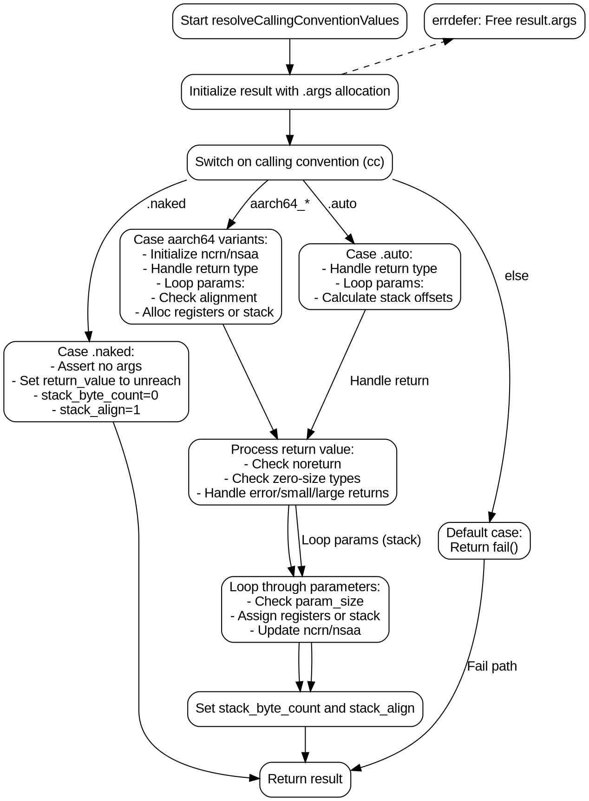

好的，我现在需要为提供的 Zig 代码生成一个流程图。首先，我需要理解这段代码的功能。看起来这个函数是处理AArch64架构下的调用约定，根据不同的调用约定（如naked、aarch64_aapcs、auto等）来设置函数参数的传递方式和返回值的位置。

首先，函数开始时会初始化一些变量，比如result，然后根据不同的调用约定cc进行不同的处理。每个case分支（如.naked、.aarch64_aapcs等）有不同的逻辑来确定参数如何传递（寄存器还是栈），以及返回值的处理。

对于流程图的结构，主流程应该从函数入口开始，然后根据cc的不同分支展开。每个分支内部可能有条件判断，比如处理返回值类型是否为noreturn，是否有运行时位等。然后处理参数，可能涉及循环遍历参数类型，计算寄存器使用或栈偏移。

需要注意的是，代码中有几个主要的条件分支：
1. 当cc是.naked时，直接设置一些默认值并返回。
2. 当cc是aarch64_aapcs及其变种时，处理返回值和参数，涉及寄存器分配和栈空间计算。
3. 当cc是.auto时，处理返回值和参数，主要是栈上的分配。
4. 其他cc则返回错误。

每个分支内部的逻辑需要分解成不同的节点，比如判断返回值类型，参数大小和对齐方式，循环处理参数等。此外，错误处理部分（如defer和errdefer）也需要考虑，但可能在流程图中简化表示。

需要特别注意循环结构，比如for循环遍历参数类型，并分配每个参数的存储位置。这可能需要在流程图中用循环节点表示。

可能的结构是：

开始 → 初始化result → 检查cc → 分不同情况处理 → 处理返回值和参数 → 设置stack_byte_count和stack_align → 返回result。

每个case分支内部可能需要多个判断和步骤，比如在aarch64_aapcs情况下，处理返回类型是否为noreturn，参数大小是否适合寄存器，是否需要对齐等。

最后，确保所有路径最终都汇聚到返回result的节点，同时处理可能的错误路径（如errdefer释放内存）。

现在需要将这些逻辑步骤转化为Graphviz的节点和边，注意条件判断的分支和循环结构。可能需要使用子图来组织不同cc的处理流程，但Graphviz中子图主要用于集群，可能不需要。直接使用条件节点和连接线来表示流程。
================================================
