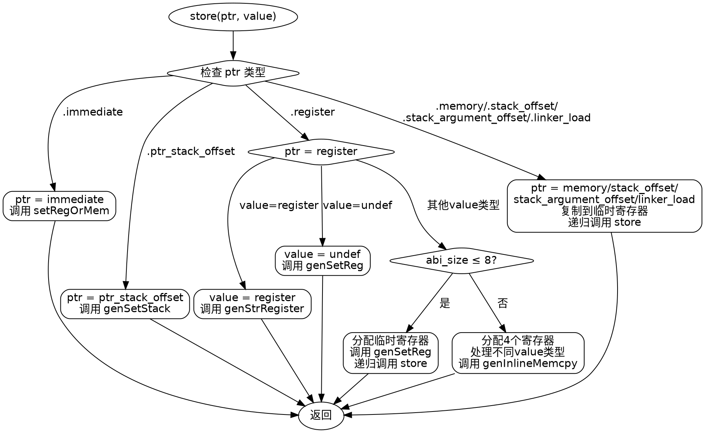

嗯，我需要为提供的Zig代码生成一个流程图。首先，我得理解这段代码的功能。看起来这是一个store函数，负责将值存储到某个内存位置。函数内部有很多分支处理不同的情况，比如不同的ptr类型和value类型。

首先，函数开始处理ptr的不同情况。比如，当ptr是.immediate时，调用setRegOrMem方法；如果是.ptr_stack_offset，调用genSetStack。当ptr是.register时，处理更复杂的情况，特别是当value的大小超过8字节时，会分配多个寄存器并进行内存拷贝。

接下来，我需要将这些逻辑分支转化为流程图的节点和判断条件。可能需要为每个switch case创建一个判断节点，然后根据条件分支到不同的处理步骤。比如，处理ptr的switch语句会有多个分支，每个分支对应不同的处理逻辑。

另外，注意到在处理.register的value时，又有一个内部的switch处理不同的value类型，比如.stack_offset、.stack_argument_offset等，这需要进一步的分支。还有当abi_size超过8字节时，会进入一个复杂的处理流程，包括分配寄存器、生成指令等。

需要注意的是，代码中有一些错误处理，比如try语句，可能需要在流程图中表示错误路径。不过可能用户主要关注正常流程，所以暂时忽略错误处理。

最后，当ptr是.memory、.stack_offset等类型时，会调用copyToTmpRegister，然后递归调用store函数，这里可能需要考虑循环或递归的情况，但在流程图中可能需要简化为一个节点，避免无限递归。

现在需要将这些逻辑结构化为graphviz的节点和边，确保每个条件分支正确连接，处理步骤清晰。可能需要使用菱形节点表示条件判断，矩形节点表示处理步骤，箭头表示流程方向。
================================================
