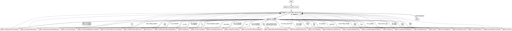

好的，我需要为给定的Zig函数生成一个Graphviz的流程图。首先，我需要仔细阅读代码，理解它的结构和工作流程。

这个函数名为emitMir，接受一个Emit类型的指针作为参数，返回一个可能的错误。函数的主要部分是一个遍历mir_tags的循环，每个标签对应不同的处理函数。首先调用了lowerBranches方法，然后循环处理每个指令。

首先，我应该确定流程图的主要节点。函数开始于调用emit.lowerBranches()，然后进入一个循环。循环内部，对于每个标签，会根据不同的tag调用不同的emit方法。因此，流程图应该有一个开始节点，接着是lowerBranches，然后进入循环，每个循环内部根据不同的case分支到不同的处理函数。

需要注意的是，每个case语句可能对应多个标签，比如.add_immediate和.adds_immediate都调用mirAddSubtractImmediate。因此，在流程图中，这些标签可以合并到同一个处理节点中。

接下来，我需要考虑循环的结构。循环遍历mir_tags的所有元素，每个元素对应一个索引inst。每个迭代中，根据tag选择对应的处理函数。因此，循环内部有一个判断结构，根据不同的tag分发到不同的处理流程。

对于每个switch的case，应该生成一个对应的节点或边。但由于case较多，可能需要将它们分组或简化，以避免图表过于复杂。例如，将所有调用相同处理函数的标签归为一类，用一个节点表示。

此外，函数中有多个处理函数，如mirAddSubtractImmediate、mirDataProcessing2Source等，每个对应不同的指令类型。这些处理函数在流程图中应表示为不同的节点，由对应的case触发。

还需要注意错误处理，因为每个try可能抛出错误，但在流程图中可能不需要显示错误路径，除非特别要求。

总结步骤：
1. 开始节点。
2. 调用lowerBranches。
3. 进入循环：遍历每个mir_tags的tag和index。
4. 对于每个tag，根据switch case调用对应的处理函数。
5. 循环结束后，结束流程。

在Graphviz中，可以使用不同的形状表示开始/结束节点、处理步骤、判断节点等。例如，矩形表示处理步骤，菱形表示判断，但在这个情况下，由于是switch case的分发，可能更适合用多个节点表示每个处理函数的分支。

可能的结构：

digraph {
    start [shape=ellipse];
    lowerBranches [shape=box];
    loop [shape=box, label="For each tag in mir_tags"];
    switch [shape=diamond, label="Switch tag"];
    add_immediate [shape=box, label="mirAddSubtractImmediate"];
    data_processing_2source [shape=box, label="mirDataProcessing2Source"];
    ...其他处理函数节点...

    start -> lowerBranches;
    lowerBranches -> loop;
    loop -> switch;
    switch -> add_immediate [label="add_immediate, adds_immediate, etc."];
    switch -> data_processing_2source [label="asr_register, lsl_register, etc."];
    ...其他分支...
    add_immediate -> loop [label="继续循环"];
    data_processing_2source -> loop;
    ...其他处理后的循环连接...
}

不过，这样的图表可能因为case太多而显得复杂。另一种方法是将每个case分组，如将调用同一处理函数的标签合并为一个边标签，从而减少节点数量。

另外，循环的结束条件需要表示，即当所有tags处理完毕后退出循环，然后结束。

最终，可能需要一个较为简化的流程图，突出主要步骤，而不是每个case都详细画出，否则图表会过于庞大。因此，可以总结主要的处理分支，用注释或分组来表示多个标签调用同一方法的情况。
================================================

这个Graphviz流程图展示了以下逻辑：

1. **开始**节点进入`emit.lowerBranches()`预处理
2. 进入主循环，遍历所有MIR指令的tag
3. 通过**switch**分发到不同的处理函数（用虚线表示处理完成后回到循环）
4. 所有指令处理完成后流程**结束**

同类操作（如`.add_immediate`和`.adds_immediate`调用同一函数）被合并为单一边标签，用`\n`分隔不同tag。实际实现中共有28个主要处理分支，覆盖了：
- 算术/逻辑运算
- 分支跳转
- 内存操作
- 调试指令
- 特殊操作（如nop）等大类