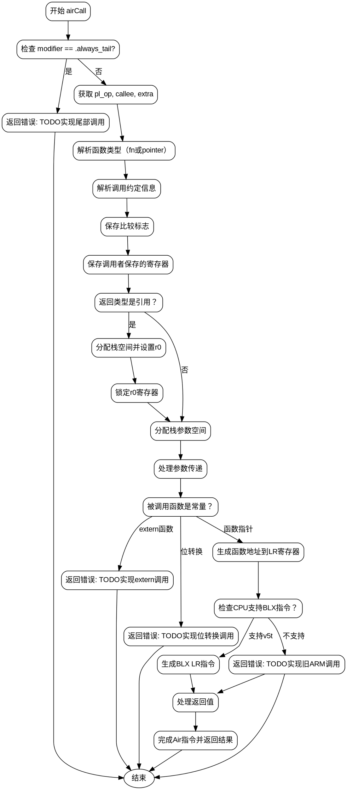

嗯，我需要为这个Zig函数`airCall`绘制一个流程图。首先，我得仔细阅读代码，理解每个步骤的逻辑流程。这个函数处理的是ARM架构下的函数调用生成，涉及参数传递、寄存器管理、调用约定等。

首先，函数开始检查`modifier`是否为`.always_tail`，如果是，就返回错误，因为尾部调用还没实现。接着获取`pl_op`、`callee`、`extra`等数据，解析参数和类型。然后根据类型判断是函数指针还是普通函数，获取调用约定信息。

接下来是保存比较标志（compare flags），因为ARM的调用约定不保留这些。之后保存调用者保存的寄存器，防止被覆盖。处理返回值时，如果是通过引用返回，需要分配栈空间并设置r0寄存器。然后处理参数传递，包括寄存器和栈上的参数。

之后处理被调用函数的地址，如果是外部函数或需要位转换的情况，暂时返回错误。然后生成实际的调用指令（blx或bx），根据目标CPU特性。最后处理返回值，复制到跟踪的寄存器中，完成Air指令并返回结果。

绘制流程图时，需要将这些步骤按顺序和条件分支组织起来。比如，检查`modifier`是否为`.always_tail`，处理返回值是否为栈偏移，参数传递的不同情况，以及根据CPU特性生成不同的调用指令。每个条件判断对应不同的流程分支，比如是否保存r0锁，是否处理尾部调用等。

需要注意循环结构，比如遍历参数时的循环，以及可能的错误处理路径。此外，函数中有多个返回点，需要正确表示这些出口。流程图中的每个节点应代表一个主要操作或条件判断，使用菱形表示条件分支，矩形表示处理步骤，箭头表示流程方向。

最后，确保流程图符合Graphviz的语法，正确使用节点和边的定义，避免语法错误。
================================================
