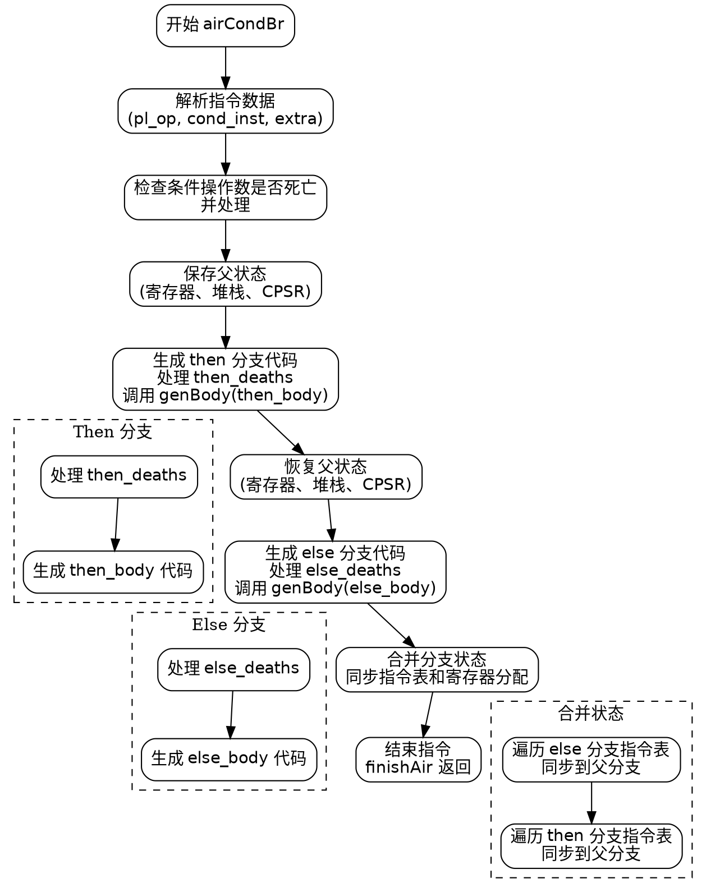

嗯，我需要为这个Zig函数`airCondBr`画一个流程图。首先，我得仔细理解这个函数的逻辑。这个函数处理条件分支，生成相应的机器码。看起来它涉及到条件判断、处理两个分支（then和else），以及合并两个分支后的状态。

首先，函数开始获取指令数据，解析条件和两个分支的代码体。然后处理条件操作数的生命周期，如果条件操作数在这里死亡，就立即处理。接下来保存当前的寄存器分配和堆栈状态，生成then分支的代码，然后恢复状态，生成else分支的代码。之后需要合并两个分支的状态，确保寄存器分配和堆栈一致，最后完成指令。

流程图应该包括主要的步骤：初始化、处理条件、保存状态、生成then分支、恢复状态、生成else分支、合并状态、结束。需要注意的是分支处理和状态恢复的步骤，特别是合并两个分支后的寄存器分配部分。可能存在循环或条件判断，比如在处理else分支时检查之前的指令状态。

需要注意函数中的错误处理（try和errdefer），这可能在流程图中表示为可能的错误路径。不过主要流程是正常执行路径。另外，`genBody`函数调用生成代码体，可能在流程图中表示为子流程。

需要确定每个步骤之间的连接关系，例如处理then分支后恢复父状态，然后处理else分支，之后合并两者的结果。合并部分可能涉及遍历两个分支的指令表，并调整寄存器或堆栈分配。

现在，将这些步骤组织成流程图的结构，使用graphviz的节点和箭头表示。确保每个关键操作都有对应的节点，条件判断如`operandDies`可能形成分支路径。不过在这个函数中，条件判断之后是线性的处理then和else，可能不需要条件节点，而是顺序执行。

可能的结构：
1. 开始
2. 解析指令和条件
3. 处理条件操作数的生命周期
4. 保存父状态
5. 生成then分支（处理死亡操作数，生成代码）
6. 恢复父状态
7. 生成else分支（同样处理死亡操作数）
8. 合并两个分支的状态
9. 清理资源，结束指令

合并状态部分较为复杂，可能需要子步骤，如遍历条目、处理冲突等。但为了简洁，可能在流程图中简化为一个步骤。

最后，确保所有步骤正确连接，没有遗漏关键点，如错误处理可能用不同的箭头表示，但主流程应集中在正常路径。
================================================
