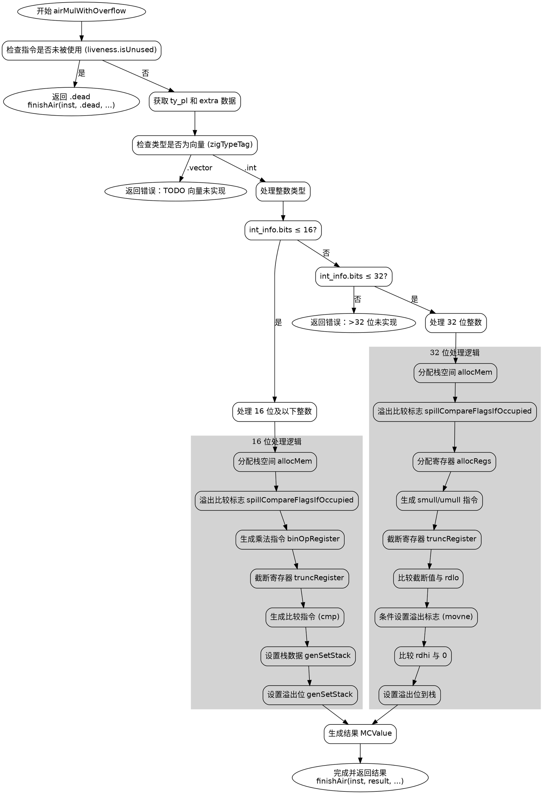

好的，我需要为给定的Zig函数`airMulWithOverflow`生成一个Graphviz流程图。首先，我要理解这个函数的结构和逻辑流程。

函数开始于获取指令数据，检查指令是否未被使用，如果是，则结束并返回。接着处理不同类型的操作数，特别是整数类型。根据整数位数（bits）的不同，分为两种情况：小于等于16位和小于等于32位，每种情况有不同的处理逻辑。对于大于32位的情况，则返回未实现的错误。

接下来，我需要将代码分解为主要的步骤和条件分支，确定每个判断点和可能的执行路径。例如：

1. 检查指令是否未被使用，如果是，返回.dead。
2. 获取类型信息，判断是否为向量类型，如果是，返回错误。
3. 处理整数类型，根据位数分支到不同处理逻辑。
4. 对于16位及以下的整数，执行特定寄存器操作和比较。
5. 对于32位整数，使用不同的乘法指令，处理高低寄存器，并进行多次比较和设置条件标志。
6. 对于超过32位的情况，返回未实现错误。

需要注意每个条件判断后的代码块，如不同的寄存器分配、指令生成、栈操作等。同时，函数中有多个返回点和循环结构需要正确表示。

接下来，我需要将这些步骤转化为Graphviz的节点和边。使用不同的形状表示开始/结束、判断、处理步骤等。例如：

- 矩形框表示处理步骤。
- 菱形表示条件判断。
- 椭圆形表示开始和结束节点。

确保所有可能的执行路径都被覆盖，特别是条件分支如`int_info.bits <= 16`和`int_info.bits <= 32`之间的过渡，以及对应的错误处理。

还需要注意函数中的子流程，例如`allocMem`、`spillCompareFlagsIfOccupied`、`binOpRegister`等函数调用，但这些可能不需要在流程图中展开，除非特别重要。

最后，验证流程图的正确性，确保没有遗漏任何关键步骤，并且逻辑顺序与代码一致。
================================================
