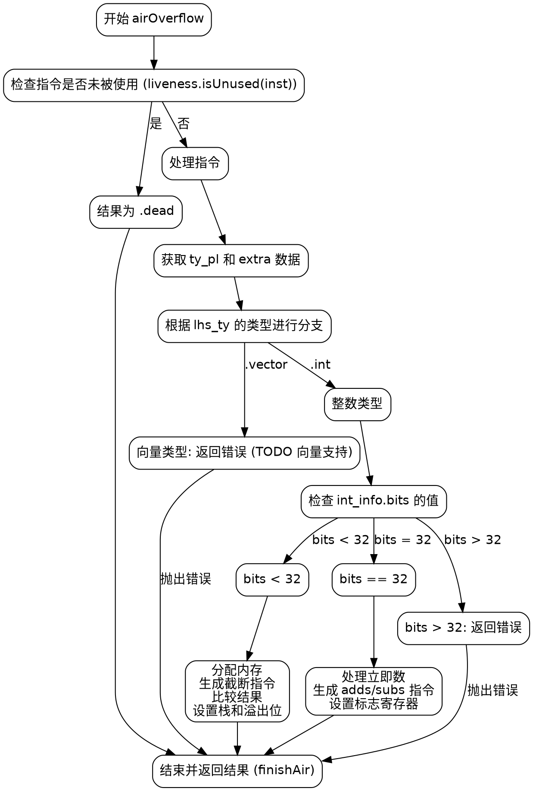

嗯，我需要为这个Zig函数画一个流程图。首先，我得仔细读一遍代码，理解它的逻辑结构。这个函数是处理带有溢出的加减操作的，比如add_with_overflow和sub_with_overflow。函数里有很多条件判断和分支，所以我得注意各个分支的情况。

首先，函数开始于airOverflow，然后获取指令的tag、ty_pl、extra数据等。接着根据是否未被使用，决定结果是.dead还是进入处理流程。这里有个大的条件判断，根据lhs_ty的类型（比如vector、int）来处理不同的情况。对于int类型，又分不同的位数情况，比如小于32位、等于32位、大于32位。

对于小于32位的整数，函数会分配内存，处理溢出位，生成机器码指令，比如sbfx/ubfx，然后比较结果，设置栈上的值。对于等于32位的情况，会处理立即数的情况，选择不同的指令（adds或subs），并根据是否有立即数优化代码。最后，根据有无符号设置不同的标志寄存器。

可能需要将整个流程分解成多个步骤，每个条件判断作为一个分支节点。比如：

1. 开始
2. 检查liveness是否未使用，如果是，结果为.dead
3. 否则，处理不同类型的ty_pl
4. 如果是int类型，检查bits大小
   a. 小于32位的情况
   b. 等于32位的情况
   c. 大于32位的情况（返回错误）
5. 在每个子情况中处理具体的指令生成和寄存器分配
6. 结束并返回结果

需要注意的是，流程图中需要包含所有的条件分支，比如switch语句中的各个case，以及可能的错误处理路径。此外，函数中的循环或递归调用可能也需要体现，但在这个函数里似乎没有明显的循环结构，主要是条件分支。

另外，像try self.spillCompareFlagsIfOccupied()这样的函数调用可能需要作为流程中的一个步骤。不过流程图主要关注控制流的结构，而不是每个函数调用的具体实现。因此，可能将这些函数调用作为处理步骤的节点，而不会深入展开。

最后，生成流程图时要注意节点的连接是否正确，特别是条件分支后的路径是否正确指向对应的处理块。比如，当int_info.bits <32时，执行相应的代码，而等于32时走另一条路径，否则报错。

现在，我需要用Graphviz的DOT语言来描述这个流程。需要定义各个节点，并用箭头连接它们，表示执行顺序和条件分支。
================================================

该流程图使用 Graphviz DOT 语言描述，清晰地展现了函数的控制流：
1. **入口**后首先检查指令是否被使用，未被使用则直接标记为 `.dead`；
2. 处理指令时根据类型分支，针对整数类型进一步按位数分三种情况处理；
3. `<32 位`时涉及内存分配、寄存器截断和溢出位计算；
4. `=32 位`时处理立即数优化和标志寄存器设置；
5. `>32 位`直接返回未实现错误；
6. 最终统一通过 `finishAir` 返回结果。