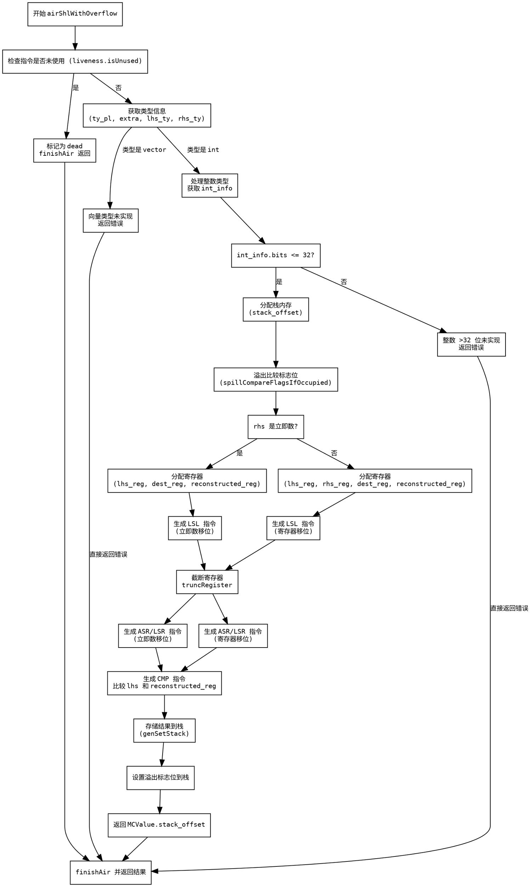

嗯，我需要为这个Zig函数`airShlWithOverflow`画一个流程图。首先，我得仔细理解这个函数的结构和逻辑。看起来这个函数处理的是带溢出的左移操作，生成相应的机器码。

首先，函数开始时会获取指令的数据类型和额外数据。然后检查指令是否未被使用，如果是的话就直接标记为dead并返回。接下来，获取一些类型和大小信息，比如tuple的大小和对齐方式，以及溢出位的偏移量。

然后根据左操作数的类型进行不同的处理。这里有一个switch语句，处理`.vector`和`.int`的情况。对于向量类型，直接返回未实现的错误。对于整数类型，进一步判断其位数是否小于等于32位。如果是，就分配内存，处理寄存器的分配，生成相应的移位指令（LSL、ASR/LSR），然后比较原始值和移位后的重构值，设置栈上的结果和溢出标志。如果整数位数超过32位，则返回未实现的错误。

流程图需要涵盖这些主要步骤：函数入口、检查指令是否未使用、处理不同类型、寄存器分配、生成指令、比较和设置结果，以及错误处理部分。需要注意条件分支，比如整数位数是否<=32，以及右操作数是否是立即数。

可能需要用不同的节点表示判断条件，比如菱形框，然后根据不同的条件走向不同的处理路径。同时，函数中的错误处理（如fail）也需要作为终止节点。另外，寄存器分配和指令生成部分可能有多个步骤，需要详细展开。

需要确保流程图的逻辑正确，覆盖所有分支，尤其是条件判断和错误处理的部分。同时，注意节点之间的箭头方向，正确表示程序执行的流程。
================================================
