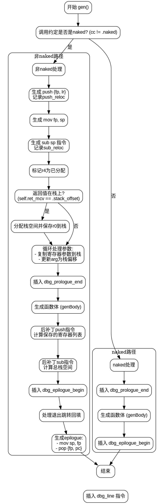

嗯，我现在需要根据提供的Zig代码生成一个流程图。首先，我要理解这段代码的结构。代码是gen函数的一部分，属于ARM架构的代码生成。函数的主要逻辑是根据调用约定（naked或非naked）生成不同的汇编指令。

首先，函数开始检查调用约定是否为naked。如果不是naked，就会执行一系列操作，比如压栈、保存寄存器、处理参数、生成函数体，最后处理返回和恢复寄存器。如果是naked，则直接生成函数体，不处理栈和寄存器。

接下来，我需要识别代码中的各个分支和步骤。主要的条件判断是cc != .naked。如果是，执行非naked路径，否则执行naked路径。在非naked路径中，有多个步骤：push指令、mov指令、sub指令、处理返回值、处理参数、生成函数体、backpatch栈空间、处理退出跳转、恢复栈和寄存器等。

流程图应该从函数开始，判断cc是否为naked。然后根据判断结果分两个分支。每个分支内部有多个步骤。需要注意循环结构，比如处理参数的循环，以及可能的条件处理，如对ret_mcv的判断。

需要确定各个步骤之间的顺序和依赖关系。比如，压栈指令后是mov指令，然后是sub指令。处理参数时有一个循环，逐个处理每个参数。生成函数体后，进行栈空间的后修补，然后处理退出跳转，最后生成epilogue部分。

可能需要注意一些细节，比如保存寄存器列表的构建，栈空间的计算，以及跳转指令的回填。这些步骤在流程图中需要用适当的节点表示，比如判断、操作、循环等。

另外，代码中有一些调试指令，如dbg_prologue_end和dbg_epilogue_begin，这些在流程图中可以作为步骤节点存在，但可能不需要特别强调。

最后，确保流程图正确反映代码的结构，包括条件分支、循环和顺序执行的部分。避免遗漏任何关键步骤，比如参数处理、栈分配、寄存器保存与恢复等。
================================================
