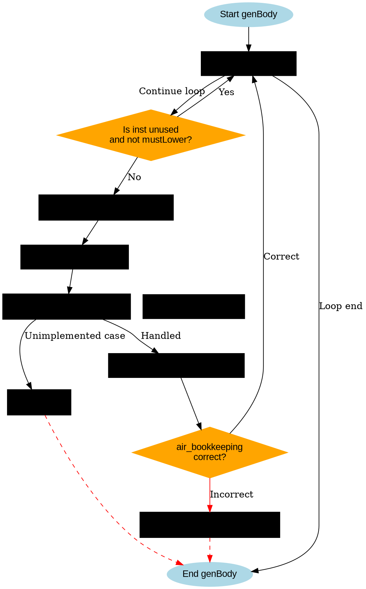

好的，我现在需要为给定的Zig函数genBody绘制一个流程图。首先，我需要理解这个函数的结构和逻辑流程。

函数genBody接收一个self指针和一个body参数，body是一个指令索引的切片。函数的主要部分是一个循环，遍历body中的每个指令inst。对于每个inst，首先检查是否未被使用且不需要强制生成，如果是则跳过。然后处理各种不同的AIR指令，根据不同的指令类型调用不同的处理方法，比如airBinOp、airPtrArithmetic等。在处理完每个指令后，还有一些断言和错误检查。

接下来，我需要将这些逻辑步骤转化为流程图。流程图应该包括开始和结束节点，循环结构，条件判断，以及不同的处理分支。需要特别注意循环体内的各个条件分支和不同的指令处理情况。

可能的步骤分解：

1. 开始节点：函数入口。
2. 循环遍历body中的每个inst。
3. 检查inst是否未被使用且不需要生成，如果是则跳过。
4. 保存旧的air_bookkeeping状态，并确保容量。
5. 重置reused_operands。
6. 根据air_tags的不同值进行switch分支处理，每个分支调用不同的方法或处理逻辑。
7. 处理完每个指令后的断言检查。
8. 循环结束，函数结束。

需要注意的是，switch语句中有很多分支，可能需要将这些分支简化为一个决策节点，表示根据不同的指令类型执行不同的处理，而不需要每个case都单独画出，否则流程图会过于复杂。此外，有些分支会返回错误或调用fail，这些也需要在流程图中体现。

在绘制流程图时，使用graphviz的语法，正确的节点和边的连接。确保条件判断使用菱形节点，处理步骤使用矩形节点，开始和结束使用椭圆节点。

可能的结构：

- 开始 -> 循环开始
- 循环开始 -> 检查inst是否跳过
- 是 -> 下一个循环迭代
- 否 -> 处理指令的各个步骤
- 处理完成后 -> 检查断言
- 循环结束 -> 结束

其中处理指令部分包含一个大的switch分支，可能需要用一个决策节点表示，然后指向不同的处理分支，但为了简化，可以合并为一个步骤，表示根据指令类型分派处理。

同时，注意在流程图中处理可能的错误路径，比如调用fail的情况，是否有返回错误或终止流程。

最终，确保流程图结构清晰，逻辑正确，不遗漏重要的步骤和分支。
================================================
