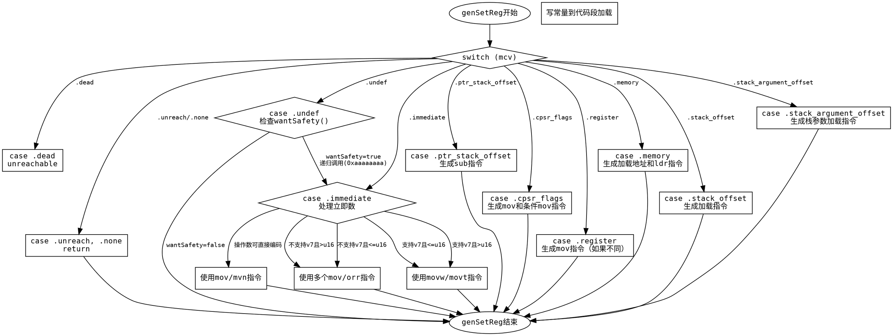

好的，我需要为提供的Zig函数`genSetReg`生成一个Graphviz的流程图。首先，我需要仔细阅读代码，理解每个分支的逻辑，然后将其转化为流程图的结构。

函数`genSetReg`处理不同类型的`MCValue`，每个`switch`分支对应不同的处理逻辑。首先，我会列出所有的`MCValue`情况，并确定每个情况下的操作步骤。例如，对于`.immediate`情况，有多个子条件，比如立即数能否用`mov`或`mvn`指令处理，或者是否需要使用`movw`和`movt`组合等。每个条件分支都需要在流程图中表示出来。

接下来，我需要确定每个分支的连接关系。例如，当处理`.undef`时，会递归调用`genSetReg`，这需要在流程图中体现为一个循环或子流程。另外，对于错误处理，如`return self.fail(...)`，也需要作为流程的一个出口。

需要注意的是，Graphviz使用节点和边来表示流程，每个条件判断对应一个菱形节点，操作用矩形节点，开始和结束用椭圆形。同时，确保所有的分支都有正确的箭头指向，避免遗漏或错误连接。

在绘制过程中，可能会遇到复杂的嵌套条件，例如在`.immediate`处理中的多个`if-else`结构。这时需要分层次处理，先处理外层条件，再处理内层，确保每个路径都被正确表示。

最后，检查流程图是否覆盖了所有可能的`MCValue`情况，包括`.dead`、`.unreach`、`.none`、`.ptr_stack_offset`、`.cpsr_flags`、`.immediate`、`.register`、`.memory`、`.stack_offset`、`.stack_argument_offset`等，并确认每个情况下的操作步骤是否正确映射到流程图中。
================================================
