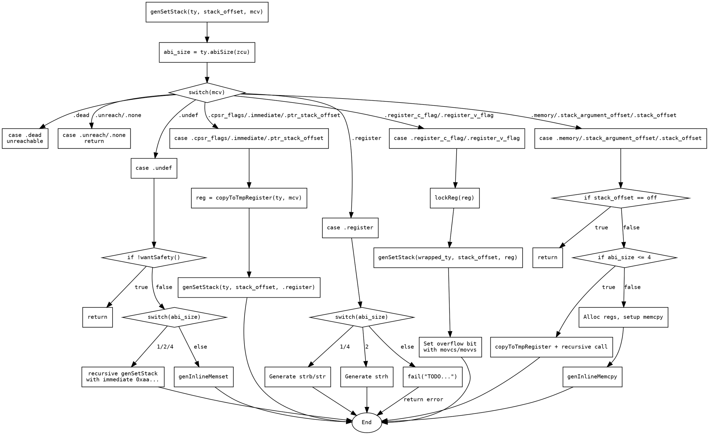

嗯，我现在需要为这个用Zig写的函数生成一个流程图。首先，我得仔细看看这个函数的逻辑结构。函数名是genSetStack，看起来是用来设置堆栈的。函数接受类型、堆栈偏移量和MCValue，然后根据不同的MCValue情况处理不同的情况。

首先，函数开始处声明了一些变量，比如pt、zcu和abi_size。然后进入一个大的switch语句，根据mcv的不同情况执行不同的代码。我需要把每个分支都理清楚。

第一个情况是.dead，直接unreachable，说明这里不应该出现。然后是.unreach和.none，直接返回，不做任何事情。接下来是.undef，这里根据abi_size的大小来决定如何处理，如果abi_size是1、2、4，就递归调用genSetStack并传入不同的立即数；否则调用genInlineMemset。这里可能是一个填充未定义内存的操作。

然后是.cpsr_flags、.immediate、.ptr_stack_offset这些情况，它们会调用copyToTmpRegister得到一个寄存器，然后递归调用genSetStack，把mcv改为.register类型。这可能是在将立即数或堆栈偏移转换为寄存器后再存储。

接下来是.register的情况，这里根据abi_size是1、4还是2分别处理。对于1和4，生成不同的存储指令（strb或str），并处理堆栈偏移量。如果偏移量可以用u12表示，就用立即数，否则需要将偏移量复制到寄存器。对于abi_size为2的情况，使用strh指令，同样处理不同的偏移量情况。其他大小的abi_size则返回错误。

然后是.register_c_flag和.register_v_flag的情况，这里涉及到处理条件标志位。首先锁定寄存器，然后处理包装类型，递归调用genSetStack。接着处理溢出位，分配条件寄存器，生成mov指令，根据条件（cs或vs）设置寄存器值，然后再设置堆栈的溢出位部分。

接下来的.memory、.stack_argument_offset、.stack_offset的情况，如果abi_size小于等于4，同样复制到临时寄存器再处理。否则，处理大块内存的复制，分配多个寄存器，设置源地址、目标地址、长度，然后调用genInlineMemcpy进行内存复制。这里需要处理不同的mcv情况，比如.stack_offset、.memory和.stack_argument_offset，分别设置源寄存器。

整个函数的流程分支很多，需要仔细画出每个switch分支的处理步骤，以及递归调用的情况。要注意各个条件判断，比如abi_size的不同值，如何处理偏移量，是否使用立即数还是寄存器等。此外，错误处理部分如返回错误也需要在流程图中体现。

现在需要考虑如何将这些逻辑步骤转化为流程图。可能需要从函数入口开始，按照条件分支逐步展开每个case，用判断框表示switch，然后每个case下的处理步骤用过程框表示，包括递归调用和错误返回。对于递归调用，可能需要用子流程或者跳转到对应的处理步骤。

需要注意的是，在生成流程图时，要正确表示每个分支的逻辑流向，尤其是递归调用和错误处理。同时，要避免循环递归导致的无限循环，但在这个函数中递归调用似乎有终止条件，比如当abi_size为1、2、4时，递归调用会传入立即数，最终可能进入其他分支处理。

可能的结构是，函数开始，计算abi_size，然后根据mcv的不同进入不同的分支，每个分支内部处理相应的逻辑，可能调用其他函数或递归，最后结束或返回错误。对于复杂的处理如内存复制，需要详细展开子步骤，如分配寄存器、设置地址、调用memcpy等。

总之，流程图需要覆盖所有可能的执行路径，包括每个case的处理步骤，递归调用，错误返回，以及各个条件判断。这样用户才能通过流程图清晰地理解函数的执行流程。
================================================
