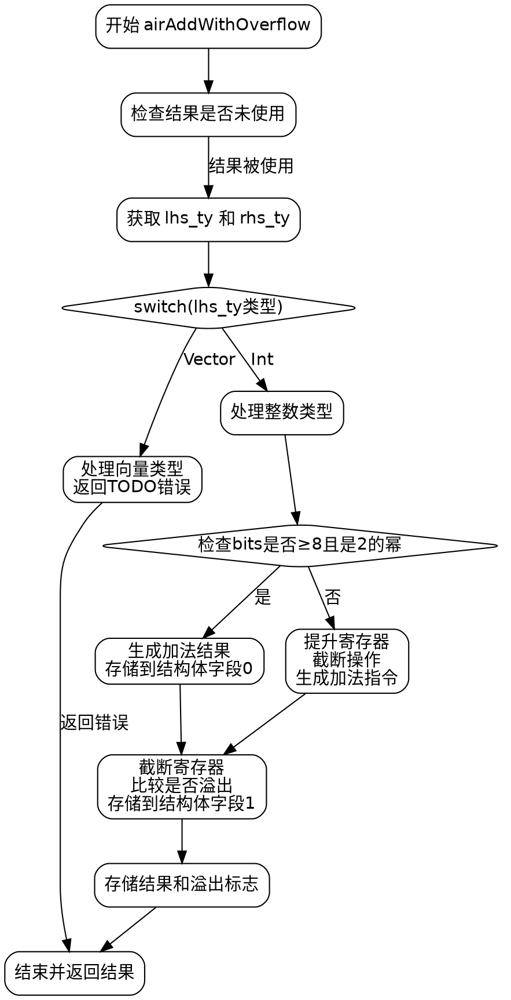

好的，我需要为给定的Zig函数`airAddWithOverflow`生成一个流程图。首先，我需要理解这个函数的结构和逻辑流程。

函数开始于处理参数，获取类型信息，然后根据不同的类型分支处理。主要的分支是当类型为整数时，处理两种情况：一种是位数为2的幂且大于等于8的情况，另一种是其他情况。每个分支里涉及寄存器分配、操作指令生成以及结果存储。

接下来，我需要将这些步骤转化为流程图中的节点。可能的节点包括：

1. 函数开始，初始化变量。
2. 检查类型是否为整数。
3. 处理向量类型（直接返回错误）。
4. 处理整数类型，判断bits是否符合条件（>=8且是2的幂）。
5. 符合条件的分支：执行加法，存储结果，处理溢出。
6. 不符合条件的分支：处理寄存器分配，执行加法，截断，处理溢出。
7. 设置内存，存储结果和溢出标志。
8. 结束函数，返回结果。

需要注意条件判断的分支，以及每个分支中的子步骤。例如，在符合条件的分支中，会生成`add_result`，然后进行截断和比较，最后存储到内存。而在不符合条件的分支中，需要处理寄存器的分配和截断，再进行加法操作，同样处理溢出。

另外，函数中有多个锁和解锁寄存器的操作，但这些可能不需要体现在流程图中，除非它们影响流程的主要路径。应该关注主要的逻辑流程，而不是具体的寄存器管理细节。

最后，确保流程图的箭头正确连接各个节点，反映函数执行的顺序和条件分支。
================================================
