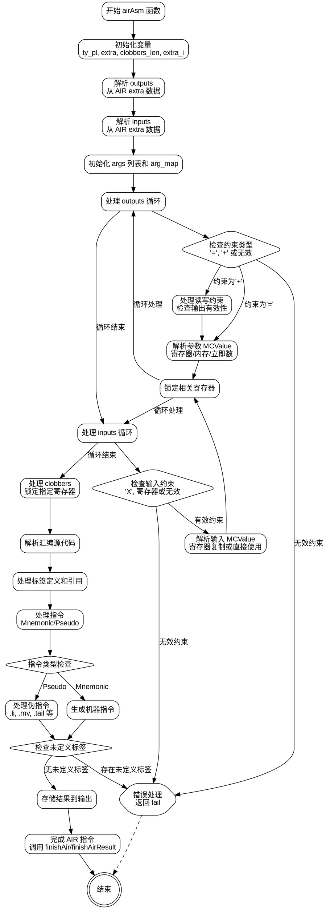

好的，我需要为提供的Zig函数`airAsm`生成一个Graphviz的流程图。首先，我需要理解这个函数的结构和逻辑流程，然后将其分解为不同的步骤和决策点，以便在流程图中表示出来。

首先，我会通读代码，了解函数的主要功能。这个函数似乎处理内联汇编指令，解析约束、输入输出操作数，生成机器代码指令，并处理标签和伪指令。函数内部有多个循环和条件判断，处理不同的情况，比如输出约束、输入约束、clobbers、标签定义和引用，以及生成相应的机器指令。

接下来，我需要确定流程图的各个节点。可能的节点包括：

1. 初始化变量，如`ty_pl`、`extra`、`clobbers_len`、`extra_i`、`outputs`、`inputs`。
2. 准备参数列表`args`和`arg_map`。
3. 处理输出约束（outputs）的循环，包括解析约束、处理寄存器、加载值等。
4. 处理输入约束（inputs）的循环，类似上面的步骤。
5. 处理clobbers部分，检查并锁定寄存器。
6. 解析汇编源代码，处理标签和指令。
7. 生成机器指令，处理伪指令如`.li`, `.mv`, `.tail`, `.ret`, `.beqz`等。
8. 处理未定义的标签错误。
9. 存储结果到输出。
10. 处理结束部分，如`finishAir`或`finishAirResult`。

每个步骤中可能存在条件判断，例如检查约束类型、寄存器是否有效、操作数类型等。这些条件分支需要在流程图中明确表示。

需要注意循环结构，比如处理outputs和inputs的循环，以及解析汇编代码行的循环。此外，错误处理（如`func.fail`）也需要作为可能的终止节点。

在绘制流程图时，需要将每个主要步骤作为节点，用箭头表示流程方向，条件判断使用菱形节点，并根据不同条件分叉。例如，处理约束是否为“=”或“+”时会有不同的处理路径。

可能遇到的挑战包括如何处理嵌套的循环和条件，以及确保所有错误情况都被覆盖。需要仔细检查代码中的每个分支，确保流程图准确反映代码逻辑。

最后，确保使用Graphviz的语法正确，节点和边的定义清晰，避免交叉和混乱的布局。可能需要将复杂的部分分解为子图，以提高可读性。
================================================
