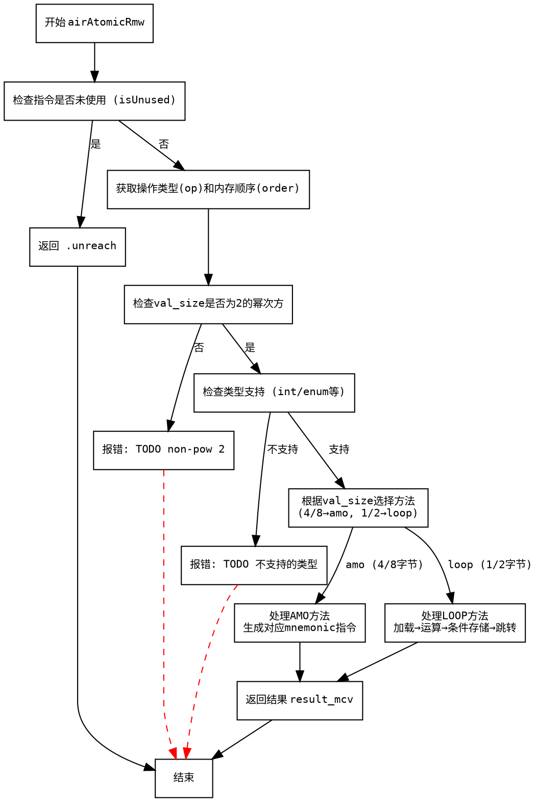

好的，我现在要画这个函数的流程图，用Graphviz。首先，我需要仔细阅读并理解这个函数的逻辑。函数是airAtomicRmw，处理原子性的读-修改-写操作。

首先，函数开始会解析一些参数，比如pt、zcu、pl_op、extra等。然后检查结果是否被使用，如果未使用，直接返回.unreach。否则进入处理逻辑。

接下来，获取操作类型op和内存顺序order。然后处理指针类型ptr_ty和值类型val_ty，检查val_size是否是2的幂次方，如果不是就报错。然后根据val_ty的类型判断是否支持，比如enum和int是允许的，其他类型如bool、float等暂时不支持。

然后根据val_size的大小决定使用amo方法还是loop方法。amo适用于4或8字节，loop适用于1或2字节。接下来，获取指针寄存器和值寄存器，并分配结果寄存器。

根据内存顺序order设置aq和rl标志。对于amo方法，根据操作类型生成对应的汇编指令，比如amoswapd、amoaddd等。对于loop方法，则生成循环结构，首先加载值，进行运算，然后尝试存储，如果失败则跳转回去重试。

在loop部分，处理Add和Sub操作，生成相应的算术指令，然后使用scw进行条件存储，检查是否成功，否则跳转回加载的地方。

最后，返回结果，结束Air指令的处理。

现在需要将这些步骤转化为流程图。流程图的节点包括开始、条件判断、各个处理分支、错误处理、结束等。需要注意各个条件分支，比如检查val_size是否是2的幂，类型检查，选择方法（amo或loop），以及各个方法内部的操作步骤。

可能的步骤节点：

1. 开始
2. 检查指令是否被使用（isUnused）→ 是→结束返回unreach
3. 否→继续处理
4. 获取op和order
5. 检查val_size是否是2的幂→否→报错
6. 是→检查类型是否支持→不支持→报错
7. 支持→根据val_size选择方法（amo或loop）
8. amo方法：生成对应mnemonic，添加指令
9. loop方法：生成循环结构，包括加载、运算、存储条件检查，跳转
10. 返回结果，结束

需要注意各个判断分支的连接，以及处理过程中的寄存器分配和释放，但流程图可能不需要详细到寄存器操作，而是控制流的走向。

现在需要用Graphviz的语法来表示这些节点和流程。使用digraph，节点用矩形或菱形表示判断，箭头连接步骤。
================================================
