嗯，我需要为这个Zig函数生成一个Graphviz的流程图。首先，我得仔细看一下代码的结构，理解每个部分的作用。函数gen接受一个Func指针，可能负责生成某种代码，比如汇编指令？

开始的时候，函数检查一些必要的特性（required_features），如果有缺失就返回错误。然后根据函数调用约定（fn_info.cc）是否为naked，分成两个大的分支。如果不是naked，会处理很多堆栈分配、寄存器保存和恢复的逻辑，包括生成函数体（genBody），处理退出跳转，以及添加各种伪指令。如果是naked，就直接生成函数体，并在前后添加调试信息。

接下来，我需要将这些逻辑步骤转化为流程图中的节点和判断分支。首先，入口点是一个开始节点。然后检查required_features，如果有问题就进入错误节点。接着判断是否是naked函数，分成两个主要的分支。

在非naked分支中，有很多步骤：添加调试信息、处理返回值的间接存储、生成函数体、处理退出跳转、恢复寄存器、调整堆栈指针等等。这些步骤需要按顺序排列，并注意循环和条件判断，比如for循环处理exitlude_jump_relocs。

需要注意的是，有些步骤是条件性的，比如是否需要保存寄存器（need_save_reg），这会影响是否生成对应的伪指令。此外，每个分支结束后都会添加调试信息，然后结束于同一个结束节点。

在绘制流程图时，需要用条件判断（菱形框）来区分不同的路径，用矩形框表示处理步骤，箭头表示流程方向。可能还需要合并一些共同的步骤，比如最后的添加调试信息，不管是否naked都会执行。

我需要确保所有可能的路径都被覆盖，特别是错误处理和条件分支。同时，保持图的结构清晰，避免交叉线过多。可能还需要将复杂的部分拆分成子图，比如处理非naked分支中的多个步骤。

最后，验证流程是否正确，确保每个判断后的步骤都正确连接，没有遗漏任何关键步骤，比如堆栈调整、寄存器保存与恢复等。
================================================

```dot
digraph flowchart {
    node [shape=rectangle, fontname="Courier", fontsize=10];
    edge [fontname="Courier", fontsize=10];

    start [label="开始 gen(func)"];
    check_features [label="检查 required_features"];
    error [label="返回错误\nfunc.fail(...)"];
    check_naked [label="fn_info.cc == .naked?"];
    handle_naked [label="非 naked 分支"];
    handle_non_naked [label="naked 分支"];
    add_prologue_end [label="添加伪指令\npseudo_dbg_prologue_end"];
    setup_backpatches [label="创建多个伪指令\n(backpatch_*)"];
    handle_ret_mcv [label="处理返回值存储\n(间接返回值存储到栈)"];
    gen_body [label="生成函数体\nfunc.genBody(...)"];
    process_exitlude [label="处理 exitlude_jump_relocs"];
    add_epilogue_begin [label="添加伪指令\npseudo_dbg_epilogue_begin"];
    setup_restore [label="创建恢复伪指令\n(backpatch_*_restore)"];
    jalr_ret [label="添加 ret 指令\njalr zero, ra, 0"];
    compute_frame [label="计算 frame_layout\n和 need_save_reg"];
    update_backpatches [label="更新伪指令\n设置堆栈调整、寄存器保存/恢复"];
    need_save_reg_check [label="need_save_reg?"];
    spill_regs [label="设置伪指令\npseudo_spill_regs"];
    restore_regs [label="设置伪指令\npseudo_restore_regs"];
    add_debug_end [label="添加调试信息\npseudo_dbg_line_column"];
    end [label="结束"];

    start -> check_features;
    check_features -> error [label="有缺失"];
    check_features -> check_naked [label="全部满足"];
    check_naked -> handle_non_naked [label="否"];
    check_naked -> handle_naked [label="是"];

    handle_non_naked -> add_prologue_end;
    add_prologue_end -> setup_backpatches;
    setup_backpatches -> handle_ret_mcv [label="处理间接返回值"];
    handle_ret_mcv -> gen_body;
    gen_body -> process_exitlude;
    process_exitlude -> add_epilogue_begin;
    add_epilogue_begin -> setup_restore;
    setup_restore -> jalr_ret;
    jalr_ret -> compute_frame;
    compute_frame -> update_backpatches;
    update_backpatches -> need_save_reg_check;

    need_save_reg_check -> spill_regs [label="是"];
    spill_regs -> restore_regs;
    need_save_reg_check -> restore_regs [label="否"];
    restore_regs -> add_debug_end;

    handle_naked -> add_prologue_end_naked [label="添加伪指令\npseudo_dbg_prologue_end"];
    add_prologue_end_naked -> gen_body_naked [label="生成函数体"];
    gen_body_naked -> add_epilogue_begin_naked [label="添加伪指令\npseudo_dbg_epilogue_begin"];
    add_epilogue_begin_naked -> add_debug_end;

    add_debug_end -> end [label="添加结束调试信息"];

    // 隐藏相同节点的重复定义
    add_prologue_end_naked [label="添加伪指令\npseudo_dbg_prologue_end"];
    gen_body_naked [label="生成函数体\nfunc.genBody(...)"];
    add_epilogue_begin_naked [label="添加伪指令\npseudo_dbg_epilogue_begin"];
}
```
