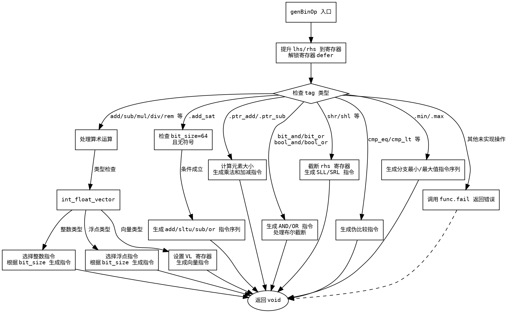

嗯，我需要帮用户生成一个函数genBinOp的流程图，用Graphviz。首先，我得仔细看看这个函数的结构。函数处理不同的二进制操作，比如加减乘除，还有位运算、比较运算等。看起来有很多条件分支，根据不同的tag和类型来选择不同的处理逻辑。

首先，函数开始的时候，处理了lhs和rhs的寄存器分配，然后根据不同的tag进入不同的处理分支。比如，对于.add、.sub等算术操作，会根据bit_size选择不同的指令。然后是浮点运算、向量运算，接着处理特定的操作如.add_sat、.ptr_add、位操作、位移、比较、min/max等。

我需要把这些逻辑分支用流程图表示出来。每个条件判断对应一个分支节点，然后不同的处理步骤作为子节点。需要注意的是，有些分支内部还有子分支，比如处理整数、浮点数、向量时的不同情况。

可能的结构是从函数入口开始，先处理寄存器分配，然后根据tag的大类分支出不同的处理流程。比如，第一个大的switch(tag)分支包括.add、.sub等，然后是.add_sat，.ptr_add，位操作，位移，比较，min/max，其他情况。

每个大分支下可能还有子条件，比如处理整数时根据bit_size选择不同的mnemonic，处理浮点数时根据bit_size选择不同的指令，向量处理时需要设置VL寄存器等。

另外，需要注意的是，某些操作如.add_sat有特定的条件判断，比如bit_size是否为64且是否为无符号类型。这些条件也需要在流程图中体现。

可能还需要处理错误情况，比如当遇到未实现的操作时，调用func.fail返回错误。

在画流程图的时候，需要确保每个条件判断都正确连接到对应的处理步骤，并且流程图的箭头方向正确。比如，如果某个条件成立，则进入对应的处理块，否则继续下一个条件判断。

可能还需要注意代码中的defer语句，用于解锁寄存器，但流程图可能不需要详细展示资源管理，主要关注逻辑流程。

最后，确保所有可能的路径都被覆盖，特别是每个switch语句的case，以及可能的错误返回路径。

现在，我需要将这些逻辑结构转化为Graphviz的节点和边。使用不同的形状表示开始、结束、判断节点、处理步骤等。比如，菱形表示条件判断，矩形表示处理步骤，椭圆形表示开始和结束。

开始节点是函数入口，然后是分配寄存器，接着根据tag进行分支判断。每个大的tag分支对应一个子流程图，内部可能还有更细的条件判断和处理步骤。

可能需要将整个函数分解为多个子图，每个大的tag分支作为一个子图，这样结构更清晰。不过，Graphviz中子图主要用于集群，可能更适合用节点和边来组织。

总之，步骤是：确定所有主要分支，绘制每个分支的条件和处理步骤，连接正确的流程，确保所有情况都被覆盖，并且结构清晰。
================================================
