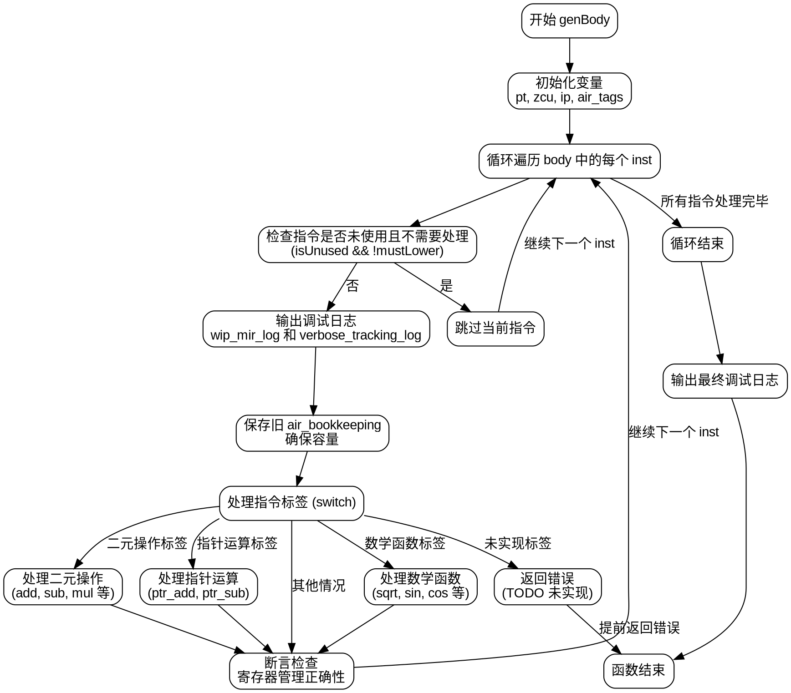

好的，我现在要帮用户用Graphviz画一个函数genBody的流程图。这个函数是用Zig写的，看起来是RISC-V 64架构的代码生成部分。我需要先理解这个函数的结构，然后根据逻辑画出流程图。

首先，函数genBody接收一个Func指针和一个body参数，body是Air指令的索引数组。函数的主要部分是一个遍历body的循环，对每个指令进行处理。循环内部有很多条件判断和不同的处理分支，特别是那个大的switch语句，处理各种不同的指令标签。

我应该从整体结构开始。函数开始时会初始化一些变量，比如pt、zcu、ip等。然后进入for循环，遍历body中的每个inst。在循环内部，首先检查指令是否未被使用且不需要降低，如果是的话就跳过。接着是一些调试日志的输出。然后保存旧的air_bookkeeping状态，确保有足够的容量处理死亡指令。之后重置reused_operands，并处理不同的指令标签。

switch语句处理各种不同的指令类型，每个case调用不同的方法，比如airBinOp、airPtrArithmetic等，或者返回错误。这里的分支非常多，可能需要将主要的switch结构简化为几个主要分支，否则流程图会太复杂。

接下来，在switch之后有一些断言和调试检查，特别是在安全模式下检查寄存器管理的正确性。循环结束后还有另一个调试日志输出。

现在要考虑如何将这些步骤转化为流程图。通常流程图包括开始、结束、判断节点、处理节点等。需要注意循环结构和条件分支。

可能的流程图结构如下：

1. 开始节点：函数入口。
2. 初始化变量（pt, zcu, ip等）。
3. For循环开始，遍历body中的每个inst。
   a. 判断inst是否未被使用且不需要降低：是的话继续循环，跳过处理。
   b. 输出调试日志。
   c. 保存旧air_bookkeeping，确保容量。
   d. 处理指令标签的switch分支，这里可能需要将switch简化为一个判断节点，然后分支到不同的处理步骤。
   e. 处理完指令后，进行断言和寄存器检查（在调试模式下）。
4. 循环结束，输出最终的调试日志。
5. 结束节点。

需要注意的是，switch语句内部有很多不同的case，如果在流程图中详细画出每个case，会导致图过于复杂。所以可能需要将switch作为一个处理节点，内部用子图或注释说明多个分支，或者只画主要的几个分支作为示例，比如处理二元操作、指针运算等，其余用“其他处理”节点代替。

另外，循环内的判断和异常处理（如返回错误）也需要在流程图中体现。例如，某些case会调用func.fail，导致函数返回错误，这时候流程应该终止。

可能的流程步骤细化：

- 开始
- 初始化变量
- 进入循环，对每个inst：
   - 检查isUnused且mustLower？是→继续循环
   - 输出日志
   - 保存旧状态，确保容量
   - 处理指令标签：
      - 根据不同标签调用不同方法（如airBinOp, airPtrArithmetic等）
      - 某些标签返回错误（如TODO情况）
   - 断言检查寄存器是否正确
   - 循环继续
- 循环结束
- 输出最终日志
- 结束

对于switch的处理，可能需要将每个case分组，比如将多个二元操作合并为一个节点，指针操作为另一个节点，未实现的返回错误等。这样流程图不会太详细但能反映主要逻辑。

此外，需要注意函数中的错误处理，例如try可能引发错误，导致函数提前返回，这些应该在流程图中用箭头表示可能的错误路径。

总结，流程图的大致结构是开始→初始化→循环处理每个指令→每个指令内部的条件处理和不同操作→循环结束→结束。需要合理简化复杂的switch分支，保持流程图的可读性。
================================================
