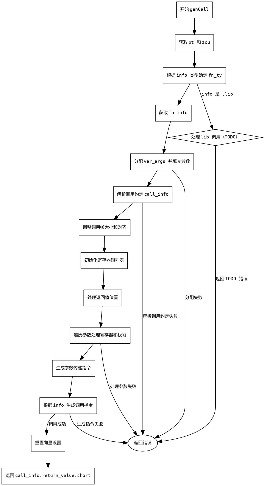

嗯，我现在需要为这个用Zig编写的函数生成流程图。函数名是genCall，位于arch/riscv64/CodeGen.zig文件中。首先，我得理解这个函数的结构和逻辑，这样才能正确地画出流程图。

首先，函数genCall的参数看起来有点复杂。它接收一个指向Func的指针func，一个联合类型的info，可能是来自Air指令或库函数的信息。然后是参数类型arg_tys和参数值args。函数返回一个MCValue或者错误。

接下来，我需要逐步分析函数的执行流程。函数一开始获取pt和zcu，然后根据info的类型（.air或.lib）确定fn_ty。如果是.air，需要从callee的类型中获取函数类型；如果是.lib，则创建一个函数类型。然后通过zcu.typeToFunc(fn_ty)获取函数信息fn_info。

之后，分配内存处理可变参数var_args，接着解析调用约定值call_info，处理调用帧的分配和对齐。这里涉及到FrameAlloc和FrameIndex的操作，可能需要记录栈帧的大小和对齐要求。

然后处理寄存器的锁定，分配frame_indices，处理返回值的存放位置，可能涉及间接返回值的处理，比如将返回值存放到栈帧中，并设置相应的寄存器。

接下来处理参数传递，根据不同的参数类型（寄存器、寄存器对、间接等）进行相应的处理，可能需要生成指令将参数加载到寄存器或栈帧中。

然后根据info的类型生成实际的调用指令。如果是.air类型，可能需要处理函数值的符号解析，生成jalr指令跳转到目标函数；如果是.lib类型，则暂时未实现，返回错误。

最后，重置向量设置，并返回call_info的返回值。

在这个过程中，需要注意条件分支，比如switch语句的不同情况，循环处理参数，错误处理（try语句），以及资源管理（如defer释放分配的内存和寄存器锁）。

现在需要考虑如何将这些步骤转化为流程图的节点和分支。可能的节点包括：

1. 开始：函数入口。
2. 获取pt和zcu。
3. 确定fn_ty的类型（根据info是.air还是.lib）。
4. 获取fn_info。
5. 分配var_args并填充参数类型。
6. 解析调用约定值call_info。
7. 分配和调整调用帧的大小和对齐。
8. 初始化寄存器锁列表。
9. 处理返回值的位置（间接返回时需要分配栈帧并设置寄存器）。
10. 遍历参数，根据参数类型处理寄存器锁定和栈帧分配。
11. 生成参数传递的指令（寄存器、栈帧等）。
12. 根据info类型生成函数调用指令（处理函数值或外部符号）。
13. 处理库函数调用（未实现，返回错误）。
14. 重置向量设置。
15. 返回call_info.return_value.short。

分支方面，比如处理info是.air还是.lib的不同路径，参数类型的不同处理方式，函数值是否存在（如if (try func.air.value(callee, pt))的分支），以及不同的函数键类型（如.func或.@"extern"）。

需要注意错误处理路径，每个try都可能跳转到错误返回。但流程图可能需要简化这些错误路径，以保持清晰。

另外，循环处理参数的部分需要用循环结构表示，比如遍历args和arg_tys。

可能的结构包括：

- 开始节点
- 判断info类型（.air或.lib）的分支节点
- 处理函数类型和调用约定的子流程
- 处理参数传递的循环结构
- 生成调用指令的条件分支（如是否找到函数值，是否是ELF文件等）
- 结束节点，返回结果

需要确保所有可能的执行路径都被覆盖，包括错误返回的情况。但由于流程图可能较为复杂，可能需要适当合并某些步骤，避免过于繁琐。

最后，确保使用Graphviz的语法正确表示节点和边，使用正确的形状（如矩形框表示步骤，菱形表示判断节点），并合理排列结构，使流程图易于理解。
================================================
