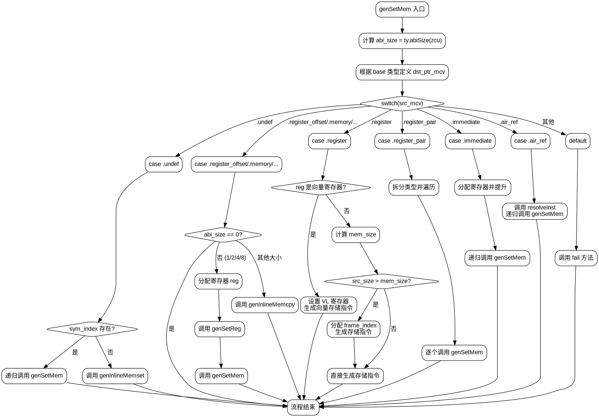

好的，我需要为提供的Zig函数`genSetMem`生成一个Graphviz的流程图。首先，我要仔细阅读代码，理解其逻辑结构，然后将其分解为不同的节点和边。

函数`genSetMem`的主要功能是根据不同的`src_mcv`类型，生成相应的内存设置指令。流程开始于参数处理，然后根据`src_mcv`的不同情况进行分支处理。

首先，函数处理了`src_mcv`为`undef`的情况，其中可能需要递归调用`genSetMem`或者调用`genInlineMemset`。接着，针对`register_offset`、`memory`等类型，根据`abi_size`的大小分情况处理，可能分配寄存器、设置寄存器值，或者调用`genInlineMemcpy`。

对于`register`类型，特别是向量寄存器，函数处理了向量存储的情况，设置VL寄存器并使用特定的存储指令。对于普通寄存器，根据内存大小和源大小的关系，可能分配临时帧索引或直接生成存储指令。

其他情况如`register_pair`、`immediate`、`air_ref`等，分别处理对应的内存设置逻辑，最后有一个默认分支处理未实现的类型。

接下来，需要将这些逻辑分支转化为流程图节点。每个`switch`的分支对应不同的处理路径，使用菱形节点表示条件判断，矩形节点表示操作步骤。需要注意递归调用和函数调用的处理，例如`genSetMem`的递归调用应表示为指向开始节点的边。

需要确保流程图的每个分支都有正确的连接，包括循环和递归的情况。同时，对于可能出现的错误处理（如`fail`调用），也要在流程图中体现。

最后，使用Graphviz的语法将所有节点和边组织起来，确保结构清晰，逻辑正确。可能需要使用子图来分组相关的处理步骤，以提高可读性。
================================================
