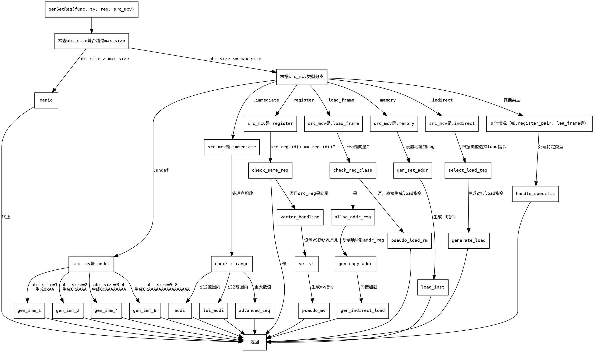

好，我需要根据提供的Zig代码生成一个函数流程图。这个函数是genSetReg，看起来是处理寄存器设置的，里面有很多分支和条件判断。首先，我需要理解这个函数的结构和各个分支。

首先，函数开始的时候检查abi_size是否超过max_size，如果超过的话就会panic。然后根据src_mcv的不同情况来处理。src_mcv是一个联合体，有很多可能的类型，比如.immediate、.register、.load_frame等等。每个情况下的处理逻辑不同，比如对于立即数，会生成不同的指令，比如addi、lui等；对于寄存器，可能需要处理向量寄存器的情况；对于内存加载，可能有不同的加载指令等等。

接下来，我需要确定每个分支的逻辑流程。比如，当src_mcv是undef时，根据abi_size的不同生成不同的立即数；如果是immediate，根据数值的大小生成不同的指令序列；如果是register，则检查是否是同一寄存器，或者处理向量寄存器的情况，然后生成mv指令。

另外，还有一些特殊情况，比如处理.load_frame时，如果是向量寄存器，需要先分配地址寄存器，然后进行间接加载；对于.indirect的情况，根据寄存器类型和大小选择不同的加载指令，比如flw、fld、lb、lh等。

在绘制流程图时，需要注意每个分支的条件判断和处理步骤，用不同的节点表示判断和操作。比如，开始节点是函数入口，然后检查abi_size是否超过max_size，接着根据src_mcv的类型进入不同的分支。每个分支内部可能有进一步的判断，比如immediate情况下根据数值范围选择不同的指令生成路径。

需要注意的是，有些分支内部还会递归调用genSetReg，比如处理undef时可能会再次调用自身，这时候在流程图中可能需要表示递归或者子流程。不过由于流程图是静态结构，可能需要用子流程节点或者注释来说明这种情况。

另外，代码中有很多错误处理，比如返回fail或者panic，这些也需要在流程图中体现出来，作为终止节点或错误处理分支。

最后，将所有分支连接起来，确保每个可能的执行路径都有对应的流程节点，形成完整的流程图。需要确保每个判断条件和操作步骤都正确无误地反映在图中。
================================================
