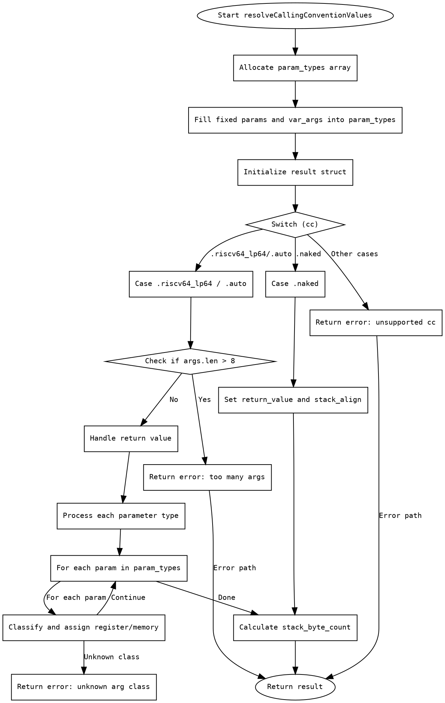

好，我需要为这个 Zig 函数生成一个流程图。首先，我需要理解这个函数的结构和逻辑。

函数名是 resolveCallingConventionValues，它处理调用约定相关的逻辑。首先，函数开始部分分配了参数类型数组 param_types，并将固定参数和可变参数填充进去。接着初始化了 result 结构体，其中包含 args、return_value、stack_byte_count 和 stack_align。

然后根据调用约定 cc 的值分情况处理。如果是 .naked，直接设置返回值和栈对齐。对于 .riscv64_lp64 或 .auto，处理返回值和参数。返回值部分根据类型判断，可能使用整数寄存器、浮点寄存器或内存。参数处理部分遍历每个参数类型，分配寄存器或内存位置。

需要注意的条件和循环：
1. 判断参数数量是否超过8个。
2. 处理返回值的分类（integer、float、memory）。
3. 遍历每个参数类型，分配寄存器或内存。
4. 错误处理，比如返回错误信息。

流程图中需要包括开始、结束节点，各个条件分支（如 switch case），循环结构（for 循环），错误处理路径。每个步骤用菱形表示判断，矩形表示操作，箭头表示流程方向。同时需要处理异常路径，如 errdefer 释放内存。

可能的结构：
- 开始节点：函数入口。
- 分配 param_types。
- 填充固定参数和可变参数。
- 初始化 result。
- 根据 cc 进入不同分支。
  - naked 分支：设置返回值和栈对齐。
  - riscv64_lp64/auto 分支：
    - 检查参数数量。
    - 处理返回值（分类到寄存器或内存）。
    - 处理每个参数（分配寄存器或内存）。
    - 错误处理路径。
  - 其他调用约定返回错误。
- 计算 stack_byte_count。
- 返回 result。

需要确保所有可能的路径都被覆盖，包括错误返回。例如，当参数超过8个时返回错误，未实现的调用约定返回错误等。

最后，流程图需要用 Graphviz 的 DOT 语言编写，节点和边正确连接，条件分支用菱形，操作用矩形，开始和结束用椭圆。
================================================
