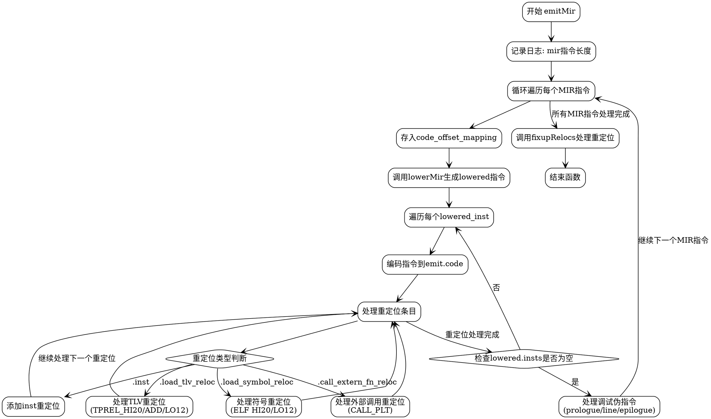

嗯，我现在需要为这个Zig函数生成一个流程图。首先，我需要理解这个函数的结构和流程。这个函数的名字是emitMir，看起来是处理一些中间表示（MIR）的指令，然后生成代码和重定位信息。

首先，函数开始的时候，获取了一个gpa（通用分配器），然后记录了一个调试日志，显示MIR指令的数量。接下来是一个循环，遍历所有的MIR指令。在循环内部，首先将当前的MIR索引和代码长度存入code_offset_mapping。然后调用lowerLower.lowerMir来降低MIR指令到更底层的表示，得到lowered变量。接着处理lowered中的指令和重定位信息。

对于每个lowered_inst，首先记录起始偏移，然后编码指令到emit.code中。然后处理重定位，根据不同的重定位类型（如inst、load_symbol_reloc、load_tlv_reloc、call_extern_fn_reloc）添加相应的重定位条目到relocs数组或者ELF文件中。这部分可能需要不同的处理方式，比如对于符号加载，需要处理HI20和LO12的重定位类型，或者TPREL相关的类型，或者CALL_PLT类型。

处理完所有重定位后，检查是否有未处理的重定位条目。如果lowered的指令长度为0，说明是伪指令，比如调试相关的指令（dbg_prologue_end、dbg_line_column、dbg_epilogue_begin等），需要更新调试信息，比如设置断点结束或开始，或者更新行号信息。

最后，循环结束后，调用fixupRelocs来处理所有的重定位。

现在，我需要将这些步骤转化为流程图。流程图应该从函数入口开始，然后按照顺序处理每个步骤，包括循环内的各个分支和条件判断。需要注意的是，循环中的每个MIR指令处理包括多个子步骤，如处理lowered_inst和重定位，以及伪指令的处理。此外，不同的重定位类型需要不同的处理分支，这可能需要多个条件判断节点。

在绘制流程图时，需要注意条件判断的分支，例如在处理重定位时，不同的target类型会进入不同的处理流程。同时，伪指令的处理也有不同的情况，比如不同的debug_output类型（dwarf、plan9、none）。另外，错误处理（如返回错误）也需要在流程图中体现吗？不过原函数中的错误处理是通过try来传播的，可能不需要特别标注，除非有显式的错误处理分支。

可能的节点包括：

1. 开始：函数入口。
2. 记录日志。
3. 循环遍历MIR指令。
   a. 存入code_offset_mapping。
   b. 调用lowerMir。
   c. 遍历lowered_insts。
      i. 编码指令。
      ii. 处理重定位。
         - 根据不同的target类型处理。
   d. 检查lowered_insts是否为空，处理伪指令。
4. 结束循环后调用fixupRelocs。
5. 结束函数。

在处理重定位时，每个lowered_reloc的条件判断需要循环处理，直到没有对应的reloc条目。每个reloc类型会有不同的操作，比如添加不同的ELF重定位条目。

对于伪指令的处理，如.pseudo_dbg_prologue_end，需要根据debug_output的类型（dwarf、plan9、none）执行不同的操作，比如设置prologue结束，记录日志，并更新PC和行号。

需要注意循环结构，比如外层循环是遍历所有MIR指令，内层循环是处理每个lowered_inst和其对应的relocs。此外，在处理relocs时，有一个内部的while循环，检查当前reloc是否属于当前的lowered_index。

在绘制流程图时，可能需要使用不同的形状来表示不同的节点类型，比如矩形表示操作，菱形表示条件判断，平行四边形表示输入/输出等。不过Graphviz的节点形状可以根据需要自定义，但通常用矩形表示步骤，菱形表示判断。

需要确保流程图的正确性，尤其是循环和条件分支的连接是否正确。例如，处理每个MIR指令时，内部的处理流程是否完整，包括所有可能的路径。

可能遇到的困难是如何将复杂的循环和嵌套的条件判断清晰地展示出来，避免交叉过多导致图形难以理解。可能需要分层次来绘制，比如外层循环的处理作为一个大节点，内部的处理流程作为子图。

不过根据用户的要求，可能需要一个整体的流程图，而不是分层的子图。因此，需要合理安排节点顺序和连接线，确保逻辑清晰。
================================================
