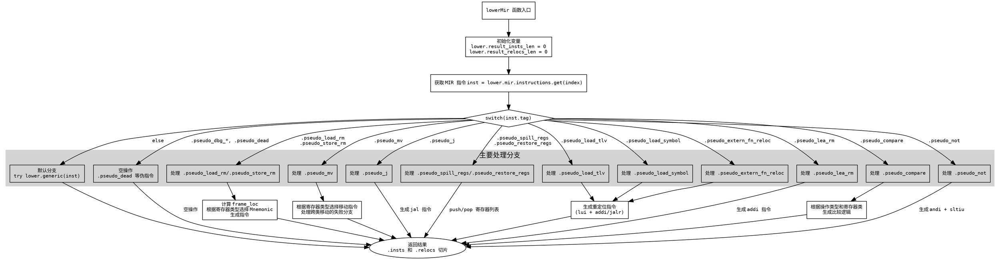

好，我需要为给定的Zig函数绘制流程图。首先，我需要理解这个函数的结构和逻辑。函数名是lowerMir，属于RISC-V 64位架构的代码生成部分。它的主要任务是将MIR（中间表示）指令转换为目标机器的指令，并处理相关的重定位信息。

首先，我会通读代码，识别主要的控制流结构。函数开始初始化一些变量，然后根据不同的指令标签（inst.tag）进行处理。主要的逻辑在switch语句中，每个case对应不同的伪指令（pseudo instructions），比如pseudo_load_rm、pseudo_store_rm、pseudo_mv等。每个case内部有不同的处理逻辑，包括条件判断、错误处理、生成指令等。

接下来，我需要确定如何将这些逻辑转化为流程图。流程图应该从函数入口开始，然后根据不同的标签分支处理。每个分支内部可能有进一步的判断和操作，例如在pseudo_load_rm中，根据目标寄存器类型选择不同的mnemonic，并生成相应的指令。此外，还有错误处理部分，如lower.fail的调用。

需要注意的是，代码中有多个switch嵌套，比如在.pseudo_load_rm中的另一个switch (inst.tag)，但实际上这个switch已经被外层处理，所以可能不需要在流程图中重复。另外，错误处理部分如errdefer和defer语句可能需要特殊的处理，但可能不需要在流程图中详细展示，除非它们直接影响控制流。

在绘制流程图时，我会使用graphviz的语法，每个主要步骤作为一个节点，条件判断作为分支节点。例如，函数开始初始化变量，然后进入主switch，每个case作为一个分支，每个分支内的逻辑按顺序连接。对于条件判断，如检查寄存器类型或操作符，使用菱形节点表示判断，然后根据结果分支出不同的处理路径。

需要特别注意循环和递归调用，但在这个函数中，似乎没有明显的循环结构，主要是顺序处理和条件分支。此外，函数的返回部分在最后，返回生成的指令和重定位信息。

在绘制过程中，要确保每个节点和边的标签清晰，正确反映代码逻辑。同时，避免遗漏任何重要的分支或步骤，例如错误处理路径或未实现的功能（如TODO部分）。

最后，检查流程图是否符合graphviz语法，确保节点和连接正确无误，没有使用mermaid的语法，如正确使用->而不是箭头符号，并用正确的形状表示不同节点类型（如矩形表示操作，菱形表示判断）。
================================================
